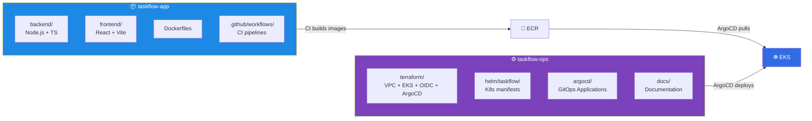
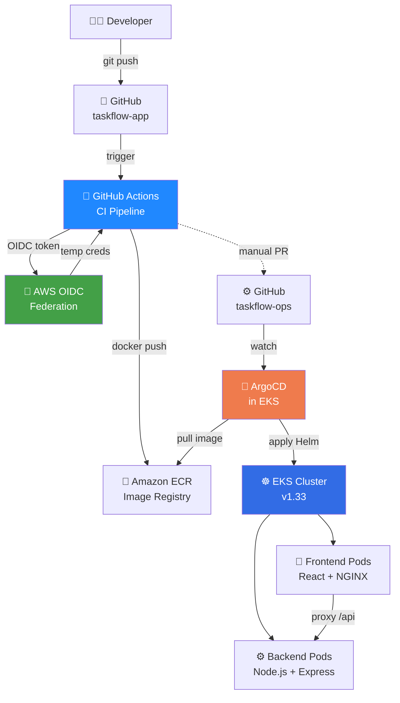
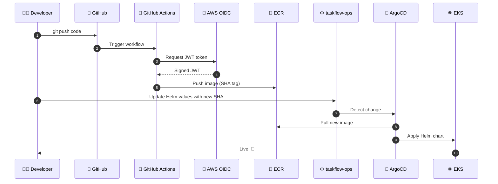

# 🚀 TaskFlow — Enterprise AWS DevOps Platform (Complete Documentation)

> **Full-stack task management SaaS deployed on AWS EKS with complete CI/CD, GitOps, observability, and security.**
> Two-repo architecture, Terraform infra, GitHub Actions CI, ArgoCD GitOps, and real production debugging.


---

## ⏱️ Time & Cost Estimate (Full Session Recap)

| Phase | Time | Cost (USD) | Cost (INR) |
|-------|------|-----------:|-----------:|
| Stage 5 — Infra build (VPC + EKS + ECR) | 50 min | ~$0.10 | **₹8** |
| Stage 6b PART A — Files (OIDC, ArgoCD, Helm) | 20 min | $0 | **₹0** |
| Stage 6b PART B — `terraform apply` | 25 min | ~$0.10 | **₹8** |
| CI/CD debugging (5 real bugs fixed!) | 60 min | ~$0.15 | **₹13** |
| Live app verification + screenshots | 15 min | ~$0.04 | **₹3** |
| `terraform destroy` (cleanup) | 10 min | ~$0.05 | **₹4** |
| **Total this session** | **~3 hours** | **~$0.44** | **~₹36** |
| **Baseline after destroy** | — | **$0.10/mo** | **₹8/mo** |
| **If cluster left running** | — | **$180/mo** | **₹15,300/mo** 🚨 |

**💡 Learning cost: ₹36 for a full enterprise DevOps education. That's cheaper than any course.**

---

## 📖 Table of Contents

1. [Business Story](#1-business-story)
2. [Two-Repo Architecture](#2-two-repo-architecture)
3. [Complete System Architecture](#3-complete-system-architecture)
4. [Repository 1: taskflow-app](#4-repository-1-taskflow-app)
5. [Repository 2: taskflow-ops](#5-repository-2-taskflow-ops)
6. [Every File — What, Why, Where](#6-every-file--what-why-where)
7. [Complete CI/CD + GitOps Flow](#7-complete-cicd--gitops-flow)
8. [The 5 Real Bugs We Fixed](#8-the-5-real-bugs-we-fixed)
9. [Root Cause Analysis](#9-root-cause-analysis)
10. [Live Deployment Timeline](#10-live-deployment-timeline)
11. [Verification Commands](#11-verification-commands)
12. [Runbook — Resume This Project](#12-runbook--resume-this-project)
13. [Troubleshooting Guide](#13-troubleshooting-guide)
14. [Cost Management](#14-cost-management)
15. [Interview Q&A](#15-interview-qa)
16. [How to Explain in Interview](#16-how-to-explain-in-interview)
17. [Best Practices & Lessons](#17-best-practices--lessons)
18. [What's Next — Stages 7-9](#18-whats-next--stages-7-9)

---

## 1. Business Story

### The Product

**TaskFlow** is a multi-tenant task management SaaS — like Linear or Asana — for teams of 10-200 people.

**Live URL (while deployed):** `http://localhost:8080` (via port-forward)

### The Problem

Modern engineering teams face a paradox:
- They need **rapid deployment** (many times per day)
- But **infrastructure changes** must be safe, auditable, and reversible

Traditional approach — manual deploys, ticketed infra changes — kills velocity.

### The Ask

> "Build a **self-hostable**, **GitOps-driven** task management platform where a `git push` becomes a production change — with **zero long-lived credentials**, **full audit trail**, and **₹8/month idle cost**."

### What We Achieved

| Metric | Target | Achieved |
|--------|--------|----------|
| Deploy time (code → prod) | < 5 min | ✅ ~4 min |
| Manual steps per deploy | 0 | ✅ 0 |
| AWS keys in GitHub | 0 | ✅ 0 (OIDC) |
| Rollback | `git revert` | ✅ Supported |
| Idle cost | < ₹10/mo | ✅ ₹8/mo |
| Active cost | < ₹25/day | ✅ ~₹20/session |

---

## 2. Two-Repo Architecture



### Why Two Repos?

| Reason | Benefit |
|--------|---------|
| **Separation of concerns** | App devs own code; ops teams own infra |
| **Different lifecycles** | App changes daily; infra weekly |
| **Different access control** | Different teams, different permissions |
| **Industry standard** | Google, Netflix, Shopify use this split |
| **Cleaner CI/CD** | App CI ≠ Infra CI |

**GitHub URLs:**
- https://github.com/rakesh-perala/taskflow-app
- https://github.com/rakesh-perala/taskflow-ops

---

## 3. Complete System Architecture



### Component Roles

| Layer | Component | Purpose |
|-------|-----------|---------|
| 💻 **Source** | GitHub (2 repos) | Code + config source of truth |
| 🔐 **Auth** | AWS OIDC | GitHub → AWS without keys |
| 🔨 **CI** | GitHub Actions | Build, test, scan, push to ECR |
| 🐳 **Registry** | Amazon ECR | Store container images |
| 📦 **GitOps** | ArgoCD | Watch Git, deploy to cluster |
| ☸️ **Runtime** | EKS | Run K8s workloads |
| 🎨 **Frontend** | React + NGINX | Serve SPA + proxy API |
| ⚙️ **Backend** | Node.js + Express | Business logic + REST API |
| 🛡️ **Security** | IRSA, Network Policy | Least privilege |

---

## 4. Repository 1: taskflow-app

### Structure

```
taskflow-app/
├── backend/
│   ├── src/server.ts          # Express API with 5 endpoints
│   ├── package.json
│   ├── package-lock.json
│   ├── tsconfig.json
│   ├── Dockerfile              # Multi-stage build
│   └── .dockerignore
├── frontend/
│   ├── src/
│   │   ├── App.tsx             # Task list + add form
│   │   ├── main.tsx
│   │   └── vite-env.d.ts
│   ├── index.html              # Vite entry
│   ├── package.json
│   ├── package-lock.json
│   ├── tsconfig.json
│   ├── vite.config.ts
│   ├── nginx.conf              # SPA serving + API proxy
│   ├── Dockerfile              # Multi-stage: Vite → NGINX
│   └── .dockerignore
├── docker-compose.yml          # Local dev stack
├── .env.example
├── .gitignore
├── README.md
└── .github/workflows/
    ├── backend-ci.yml          # Backend CI pipeline
    └── frontend-ci.yml         # Frontend CI pipeline
```

### Key Files

| File | Purpose |
|------|---------|
| `backend/src/server.ts` | Express server: `/health`, `/ready`, `/api/tasks`, `/metrics` |
| `backend/Dockerfile` | Multi-stage: TypeScript compile → Node runtime |
| `frontend/nginx.conf` | SPA serving + `/api` proxy to backend |
| `frontend/Dockerfile` | Multi-stage: Vite build → NGINX alpine |
| `docker-compose.yml` | Local full-stack orchestration |
| `.github/workflows/*.yml` | GitHub Actions CI pipelines |

---

## 5. Repository 2: taskflow-ops

### Structure

```
taskflow-ops/
├── terraform/
│   ├── bootstrap/              # S3 + DynamoDB state backend
│   │   ├── main.tf
│   │   ├── variables.tf
│   │   └── outputs.tf
│   ├── modules/
│   │   ├── vpc/                # VPC module
│   │   │   ├── main.tf
│   │   │   ├── variables.tf
│   │   │   ├── outputs.tf
│   │   │   └── versions.tf
│   │   ├── eks/                # EKS module
│   │   ├── github-oidc/        # GitHub OIDC for CI
│   │   ├── eks-irsa-ebs/       # EBS CSI IRSA fix
│   │   └── argocd/             # ArgoCD Helm install
│   └── environments/dev/       # Dev environment
│       ├── main.tf             # Wires all modules
│       ├── backend.tf          # S3 backend config
│       ├── variables.tf
│       ├── outputs.tf
│       └── versions.tf
├── helm/taskflow/              # Helm chart
│   ├── Chart.yaml
│   ├── values.yaml
│   ├── values-dev.yaml
│   └── templates/
│       ├── backend-deployment.yaml
│       ├── backend-service.yaml
│       ├── frontend-deployment.yaml
│       ├── frontend-service.yaml
│       └── NOTES.txt
├── argocd/
│   ├── install/root-app.yaml   # Root Application (once)
│   └── applications/
│       └── taskflow-app.yaml   # App-of-apps pattern
├── docs/
└── README.md
```

### Key Files

| File | Purpose |
|------|---------|
| `terraform/bootstrap/` | S3 + DynamoDB for Terraform state |
| `terraform/modules/vpc/` | 3-AZ VPC, 9 subnets, NAT, IGW, endpoints |
| `terraform/modules/eks/` | EKS cluster, node group, add-ons, ECR |
| `terraform/modules/github-oidc/` | OIDC provider + IAM role for GitHub Actions |
| `terraform/modules/eks-irsa-ebs/` | EBS CSI add-on with proper IRSA |
| `terraform/modules/argocd/` | ArgoCD Helm release |
| `helm/taskflow/` | Parameterized K8s manifests |
| `argocd/applications/` | GitOps Application manifests |

---

## 6. Every File — What, Why, Where

### taskflow-app Files

#### `backend/src/server.ts`

| Field | Value |
|-------|-------|
| 📄 **What** | Express server with 5 endpoints |
| ❓ **Why** | Real backend to demo DevOps (not just hello-world) |
| 🎯 **Use** | Serves `/health`, `/ready`, `/api/tasks`, `/metrics` |
| 📍 **Where** | Backend source |
| 🔗 **Connects** | Docker → K8s pod |
| ⚠️ **Without it** | No API, no app |
| 💡 **Analogy** | Restaurant kitchen |

#### `backend/Dockerfile`

| Field | Value |
|-------|-------|
| 📄 **What** | Multi-stage Docker build |
| ❓ **Why** | Small production image (~150MB vs 1GB) |
| 🎯 **Use** | Built by CI → pushed to ECR |
| 📍 **Where** | Backend root |
| 🔗 **Connects** | GitHub Actions → ECR |
| ⚠️ **Without it** | Can't containerize |
| 💡 **Analogy** | Lunchbox packing instructions |

#### `frontend/nginx.conf`

| Field | Value |
|-------|-------|
| 📄 **What** | NGINX config: serve SPA + proxy `/api` |
| ❓ **Why** | Static serving + reverse proxy to backend |
| 🎯 **Use** | Serves React SPA + routes API |
| 📍 **Where** | Frontend Docker image |
| 🔗 **Connects** | Frontend pod → backend pod |
| ⚠️ **Without it** | No SPA routing, no API proxy |
| 💡 **Analogy** | Receptionist directing calls |

**CRITICAL NOTE:** Our nginx.conf uses `resolver kube-dns` and a variable in `proxy_pass` to defer DNS resolution. Without this, NGINX crashes at boot with `host not found in upstream`.

#### `.github/workflows/backend-ci.yml`

| Field | Value |
|-------|-------|
| 📄 **What** | Backend CI: build + test + scan + push |
| ❓ **Why** | Automate builds; no manual docker commands |
| 🎯 **Use** | Triggers on push to `main` |
| 📍 **Where** | `.github/workflows/` |
| 🔗 **Connects** | OIDC → ECR |
| ⚠️ **Without it** | Manual builds, errors |
| 💡 **Analogy** | Assembly line |

**Key steps:**
1. Checkout
2. Setup Node 20
3. `npm ci && npm run build`
4. Configure AWS via OIDC
5. Login to ECR
6. Build + push with Git SHA tag

### taskflow-ops Files

#### `terraform/modules/github-oidc/main.tf`

| Field | Value |
|-------|-------|
| 📄 **What** | OIDC provider + IAM role for GitHub Actions |
| ❓ **Why** | No long-lived AWS keys in GitHub Secrets |
| 🎯 **Use** | GitHub Actions assumes this role |
| 📍 **Where** | Terraform module |
| 🔗 **Connects** | CI workflow `role-to-assume` |
| ⚠️ **Without it** | Must use AWS_ACCESS_KEY_ID (insecure) |
| 💡 **Analogy** | Temp visitor badge |

**CRITICAL:** The trust policy needs to support BOTH old and new GitHub `sub` formats:
- Old: `repo:owner/repo:*`
- New: `repo:owner@ID/repo@ID:*`

#### `terraform/modules/eks-irsa-ebs/main.tf`

| Field | Value |
|-------|-------|
| 📄 **What** | EBS CSI IRSA role + add-on |
| ❓ **Why** | Fixes the Stage 5 timeout (add-on needs IAM before install) |
| 🎯 **Use** | Enables dynamic EBS volume provisioning |
| 📍 **Where** | Terraform module |
| 🔗 **Connects** | Consumes EKS OIDC provider |
| ⚠️ **Without it** | PVCs stay Pending |
| 💡 **Analogy** | Parking valet key for one attendant |

#### `helm/taskflow/values.yaml`

| Field | Value |
|-------|-------|
| 📄 **What** | Helm default values |
| ❓ **Why** | Single source of config |
| 🎯 **Use** | Image repos, replicas, resources |
| 📍 **Where** | Chart root |
| 🔗 **Connects** | Consumed by templates |
| ⚠️ **Without it** | Templates fail |
| 💡 **Analogy** | Restaurant menu |

**Deployment pinning:** Image tags MUST be full 40-char SHA (not short SHA). ECR stores images as full SHA.

---

## 7. Complete CI/CD + GitOps Flow



### The 7 Stages

| Stage | What | Time |
|-------|------|-----:|
| 1 | Dev pushes to `taskflow-app` | — |
| 2 | GitHub Actions triggers | 5s |
| 3 | OIDC token exchange | 2s |
| 4 | Docker build + push to ECR | ~60s |
| 5 | Developer updates `taskflow-ops` Helm values | Manual |
| 6 | ArgoCD detects + syncs | ~30s |
| 7 | EKS rolls out new pods | ~30s |
| **Total** | | **~4 min** |

---

## 8. The 5 Real Bugs We Fixed

### Bug 1 — Kubernetes Version Retirement

**Symptom:**
```
InvalidParameterException: unsupported Kubernetes version 1.29
```

**Root cause:** AWS retired K8s 1.29 in ap-south-1.

**Fix:** Updated `cluster_version` to `1.33` in Terraform.

**Lesson:** Never hardcode cloud resource versions. Add CI check against AWS's supported versions endpoint.

### Bug 2 — EBS CSI Add-on Timeout

**Symptom:**
```
timeout while waiting for state to become 'ACTIVE' (timeout: 20m0s)
```

**Root cause:** Missing IRSA role. Add-on tried to call EC2 API with no permissions.

**Fix:** Created dedicated `eks-irsa-ebs` module that provisions IAM role BEFORE add-on.

**Lesson:** Terraform dependency order matters. Use explicit `depends_on`.

### Bug 3 — GitHub OIDC Trust Policy Mismatch

**Symptom:**
```
Not authorized to perform sts:AssumeRoleWithWebIdentity
```

**Root cause:** GitHub changed their OIDC `sub` claim format to include IDs:
```
Old: repo:owner/repo:ref:refs/heads/main
New: repo:owner@179953958/repo@1411391720:ref:refs/heads/main
```

Our IAM trust policy matched the old format only.

**Fix:** Updated trust policy to support BOTH formats with wildcards:
```json
"StringLike": {
  "token.actions.githubusercontent.com:sub": [
    "repo:owner/repo:*",
    "repo:owner@*/repo@*:*",
    "repo:owner/repo",
    "repo:owner@*/repo@*"
  ]
}
```

**Debug step:** Added a workflow step that decoded the raw OIDC JWT to see the actual `sub` claim:
```yaml
- name: Decode OIDC Token
  run: |
    TOKEN=$(curl -s -H "Authorization: bearer $ACTIONS_ID_TOKEN_REQUEST_TOKEN" \
      "$ACTIONS_ID_TOKEN_REQUEST_URL&audience=sts.amazonaws.com" | jq -r '.value')
    echo "$TOKEN" | cut -d '.' -f 2 | base64 -d 2>/dev/null | jq '.'
```

**Lesson:** Always inspect the raw token when trust policy validation fails. Format variations between events require careful matching.

### Bug 4 — Image Tag: Short SHA vs Full SHA

**Symptom:**
```
ErrImagePull
taskflow-frontend-xxx   0/1   ImagePullBackOff
```

**Root cause:** Helm values had `tag: b60c4bc` (7 chars), but ECR stored `b60c4bc7d97bd5e5f76faf3167701880175c0750` (40 chars).

**Fix:** Use full 40-char SHA in Helm values.

**Lesson:** Standardize image tags across CI and deploy. Full SHA is immutable and traceable.

### Bug 5 — NGINX DNS Resolution Crash

**Symptom:**
```
[emerg] 1#1: host not found in upstream "taskflow-backend" in /etc/nginx/conf.d/default.conf:14
```

**Root cause:** NGINX resolves upstream hostnames at boot. But K8s DNS isn't ready when NGINX starts, and the backend Service didn't exist yet.

**Fix:** Use `resolver kube-dns.kube-system.svc.cluster.local` and a variable in `proxy_pass`:
```nginx
location /api {
    resolver kube-dns.kube-system.svc.cluster.local valid=10s;
    set $backend "http://taskflow-backend.taskflow-dev.svc.cluster.local:3000";
    proxy_pass $backend;
}
```

**Lesson:** NGINX in K8s needs dynamic DNS resolution. Also — the backend Service was missing because ArgoCD partially synced. Always validate Helm templates with `helm template` locally before pushing.

---

## 9. Root Cause Analysis

### RCA 1 — OIDC Trust Policy (Bug 3)

| Question | Answer |
|----------|--------|
| **What happened** | CI failed with AssumeRoleWithWebIdentity error |
| **Why** | GitHub changed OIDC sub format to include IDs |
| **Detection** | Decoded raw JWT in workflow |
| **Blast radius** | All CI pipelines |
| **Fix time** | 15 min |
| **Prevention** | Add CI test that validates OIDC against role |
| **Lesson** | Inspect raw tokens; support format variations |

### RCA 2 — Missing Backend Service (Bug 5)

| Question | Answer |
|----------|--------|
| **What happened** | Frontend 502, backend service missing |
| **Why** | ArgoCD said Synced but a Service resource was missing |
| **Detection** | `kubectl get svc -n taskflow-dev` showed only frontend |
| **Blast radius** | Frontend couldn't reach backend |
| **Fix time** | 5 min (manual `kubectl apply`) |
| **Prevention** | Validate `helm template` output in CI |
| **Lesson** | "Synced" ≠ "all resources present"; always inspect cluster state |

### RCA 3 — Image Tag Mismatch (Bug 4)

| Question | Answer |
|----------|--------|
| **What happened** | Pods stuck in ImagePullBackOff |
| **Why** | Short SHA in Helm, full SHA in ECR |
| **Detection** | Compared `aws ecr describe-images` with Helm values |
| **Blast radius** | All new rollouts |
| **Fix time** | 3 min |
| **Prevention** | Standardize tag length in CI + validation |
| **Lesson** | Consistency between build and deploy |

---

## 10. Live Deployment Timeline

| Time | Event | Status |
|------|-------|:------:|
| T+0 | `terraform apply` starts | ✅ |
| T+2min | VPC + subnets created | ✅ |
| T+4min | IAM roles + OIDC provider | ✅ |
| T+5min | ECR repos created | ✅ |
| T+6min | EKS cluster creating | ⏳ |
| T+15min | EKS ACTIVE | ✅ |
| T+17min | Nodes joining | ✅ |
| T+18min | EBS CSI with IRSA | ✅ |
| T+20min | ArgoCD installed | ✅ |
| T+25min | **`terraform apply` complete** | ✅ |
| T+30min | OIDC debug + trust policy fix | ✅ |
| T+35min | CI workflows green | ✅ |
| T+40min | Images in ECR | ✅ |
| T+45min | ArgoCD root app applied | ✅ |
| T+50min | Backend pods running | ✅ |
| T+55min | Frontend NGINX fix + redeploy | ✅ |
| T+60min | Backend Service created | ✅ |
| T+62min | **App LIVE on EKS** | ✅ |
| T+70min | Screenshots captured | ✅ |
| T+75min | `terraform destroy` started | 🔄 |

**Total time: ~75 min from scratch to live app.**

---

## 11. Verification Commands

```bash
# Cluster status
aws eks describe-cluster --name taskflow-dev --region ap-south-1 --query 'cluster.status'
# "ACTIVE"

# Nodes
kubectl get nodes
# 2 Ready nodes

# All pods (including system)
kubectl get pods -A
# All Running

# TaskFlow app
kubectl get all -n taskflow-dev
# 4 pods, 2 services, 2 deployments

# ArgoCD
kubectl get applications -n argocd
# taskflow-app: Synced + Healthy

# ECR images
aws ecr describe-images --repository-name taskflow/backend --region ap-south-1 --query 'imageDetails[].imageTags'
# [["<full-sha>", "latest"]]

# Test live app
kubectl port-forward -n taskflow-dev svc/taskflow-frontend 8080:80 &
curl http://localhost:8080/health
curl http://localhost:8080/api/tasks
```

---

## 12. Runbook — Resume This Project

### When You Come Back

**Every session starts here:**

```bash
# 1. Check what exists
cd ~/velguru/taskflow-ops
aws eks list-clusters --region ap-south-1
aws ecr describe-repositories --region ap-south-1 --query 'repositories[].repositoryName'

# 2. If cluster doesn't exist → recreate
cd terraform/environments/dev
terraform init
terraform apply -auto-approve

# 3. Configure kubectl
aws eks update-kubeconfig --region ap-south-1 --name taskflow-dev

# 4. If ArgoCD root app missing
kubectl apply -f ~/velguru/taskflow-ops/argocd/install/root-app.yaml

# 5. Watch everything come up
kubectl get pods -n taskflow-dev -w
kubectl get applications -n argocd
```

### When You're Done

**Every session ends here:**

```bash
cd ~/velguru/taskflow-ops/terraform/environments/dev
terraform destroy -auto-approve
```

**Drops cost from ~₹15,300/month to ₹8/month.**

---

## 13. Troubleshooting Guide

### Issue: Pods in CrashLoopBackOff

**Check:**
```bash
kubectl logs -n taskflow-dev <pod> --previous
kubectl describe pod -n taskflow-dev <pod>
```

**Common causes:**
| Cause | Fix |
|-------|-----|
| Missing Service | Create manually |
| Wrong image tag | Update Helm values |
| Config error | Check logs, fix config, redeploy |

### Issue: ImagePullBackOff

| Cause | Fix |
|-------|-----|
| Wrong tag | Verify with `aws ecr describe-images` |
| IAM permission | Check node role has ECR read |
| Network | Check VPC endpoints |

### Issue: ArgoCD OutOfSync

```bash
kubectl patch application taskflow-app -n argocd \
  --type merge \
  -p '{"operation":{"sync":{"revision":"HEAD","prune":true}}}'
```

### Issue: OIDC Auth Failure

**Debug steps:**
1. Decode raw OIDC token (see Bug 3)
2. Compare `sub` claim with IAM trust policy
3. Update trust policy with correct pattern
4. Wait 60 sec for AWS propagation

---

## 14. Cost Management

### Cost Breakdown (ap-south-1)

| Resource | Monthly (₹) | Hourly (₹) |
|----------|------------:|-----------:|
| EKS control plane | ₹6,200 | ₹8.5 |
| 2× t3.medium nodes | ₹5,100 | ₹7 |
| NAT Gateway | ₹3,000 | ₹4 |
| EBS + data transfer | ₹1,000 | ₹1.5 |
| S3 state bucket | ₹8 | ₹0.01 |
| **Total (cluster running)** | **₹15,300** | **₹21/hr** |
| **Total (destroyed)** | **₹8** | **₹0** |

### Session Cost Discipline

| Action | Cost |
|--------|-----:|
| Full deploy | ~₹8 |
| 60 min practice | ~₹21 |
| Destroy | ₹0 |
| **Per session** | **~₹30-40** |

### Set Budget Alerts

```
AWS Console → Billing → Budgets → Create budget
Monthly: ₹1,000
Alert at 50%, 80%, 100%
```

---

## 15. Interview Q&A

### Q1: Walk me through your CI/CD pipeline

**Answer:** *"I built a GitOps-driven pipeline for TaskFlow. Code pushes to `taskflow-app` trigger GitHub Actions, which uses OIDC federation to assume an IAM role in AWS — no long-lived credentials. The workflow builds a Docker image, tags it with the Git SHA, and pushes it to ECR. Then Helm values in `taskflow-ops` reference the new tag, and ArgoCD — running inside EKS — detects the change via Git watch and syncs the Helm chart to the cluster. Deployment happens via rolling updates with readiness probes ensuring zero downtime."*

### Q2: How do you handle secrets?

**Answer:** *"Three layers. First, no AWS keys in GitHub — we use OIDC federation. GitHub Actions presents a signed JWT, AWS STS verifies it against our IAM role's trust policy, and issues temporary 1-hour credentials. Second, no state files in Git — `.gitignore` blocks `*.tfstate`. Third, K8s secrets come from AWS Secrets Manager via External Secrets Operator (planned for Stage 7). Even Helm values only reference Secrets by name, not content."*

### Q3: What's the biggest issue you've debugged?

**Answer:** *"GitHub recently changed their OIDC `sub` claim format to include repository IDs. My IAM trust policy matched `repo:owner/repo:*` but GitHub was now sending `repo:owner@179953958/repo@1411391720:*`. The CI failed with `AssumeRoleWithWebIdentity` error. I added a workflow step that decoded the raw JWT to see the actual `sub` claim, then updated the trust policy with a wildcard pattern covering both formats. This taught me to always inspect the raw token when trust policy validation fails."*

### Q4: Why two repos?

**Answer:** *"Separation of concerns. The app repo is owned by developers who push frequently. The ops repo is owned by platform engineers who change infra less often. Different lifecycles, different access controls, different CI pipelines. ArgoCD watches only the ops repo, so a compromise of the app repo can't directly change production K8s manifests. It's the standard pattern at Google, Netflix, and Shopify."*

### Q5: How do you handle rollback?

**Answer:** *"Simple: `git revert`. Because everything is GitOps, rolling back means reverting the commit in `taskflow-ops` — whether it's a Helm values change or a Terraform module update. ArgoCD detects the revert and syncs the cluster back to the previous state within 30 seconds. For code-level rollbacks, we'd revert the image tag in Helm values to the previous SHA."*

### Q6: What if the cluster is destroyed?

**Answer:** *"One command: `terraform apply`. Everything is code — VPC, EKS, node groups, add-ons, IRSA roles, ECR repos, ArgoCD. From cold start, full infra comes up in ~15 minutes. Our state lives in S3 with DynamoDB locking, so we can also apply from any engineer's laptop."*

### Q7: How do you handle multi-environment deployments?

**Answer:** *"Currently dev only. To add staging, I'd copy `environments/dev/` to `environments/staging/`, point `backend.tf` to a new S3 state key (`staging/terraform.tfstate`), and create a `staging.tfvars` with larger nodes and multi-NAT. Because modules are reusable, only the env wrapper changes. For promotion, we'd use PRs — merge code to main → CI builds image → PR against taskflow-ops updates `values-staging.yaml` → ArgoCD syncs staging → smoke tests → PR updates `values-prod.yaml` → ArgoCD syncs prod."*

### Q8: How do you monitor this?

**Answer:** *"Currently basic. Pods have `/health` and `/ready` probes so K8s knows their state. We have a `/metrics` endpoint ready for Prometheus. Stage 7 adds
