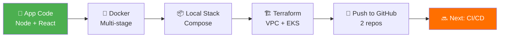
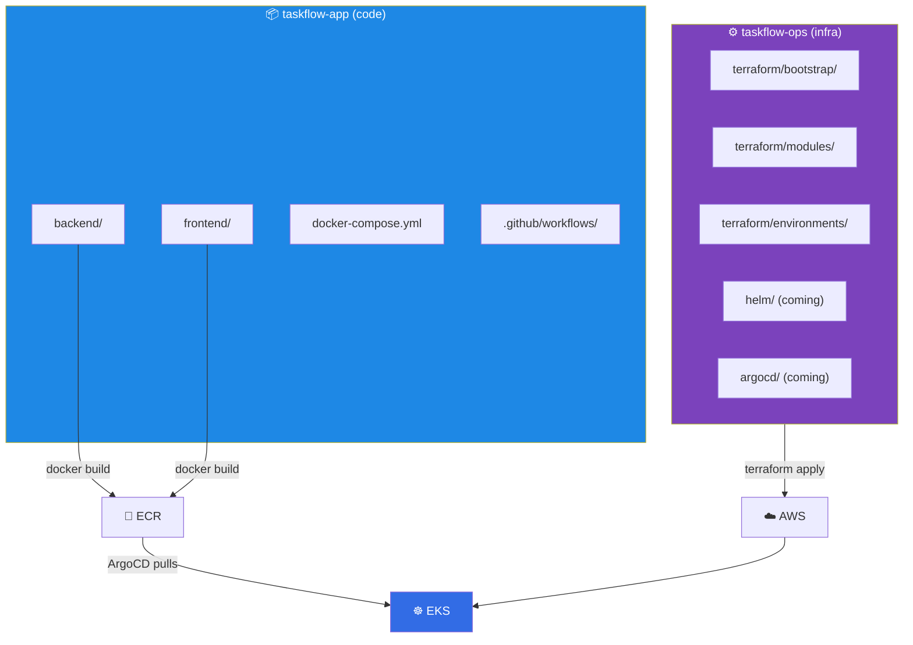
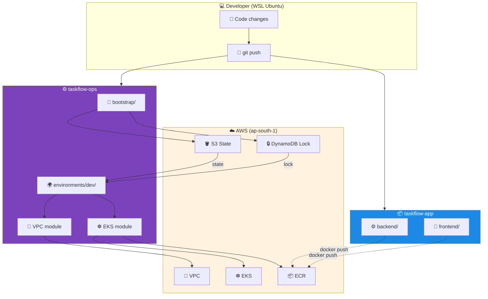

# 📋 TaskFlow — Stage 5 Complete: Code + Infra Pushed to GitHub

> **Full retrospective of Stage 5: what we built, why we built it, every file explained, every command run, every issue fixed — from app code to Terraform infra to GitHub push.**


---

## 📖 Table of Contents

1. [What Stage 5 Delivered](#1-what-stage-5-delivered)
2. [Business Story](#2-business-story)
3. [Two Repos — How They Connect](#3-two-repos--how-they-connect)
4. [Repo 1: taskflow-app (Application)](#4-repo-1-taskflow-app-application)
5. [Repo 2: taskflow-ops (Infrastructure)](#5-repo-2-taskflow-ops-infrastructure)
6. [Every File — What, Why, Where](#6-every-file--what-why-where)
7. [How Everything Connects](#7-how-everything-connects)
8. [Deployment Timeline — Full Story](#8-deployment-timeline--full-story)
9. [Issues We Hit & Fixed](#9-issues-we-hit--fixed)
10. [Root Cause Analysis](#10-root-cause-analysis)
11. [Verification Commands](#11-verification-commands)
12. [Cost Breakdown & Teardown](#12-cost-breakdown--teardown)
13. [Interview Questions & Answers](#13-interview-questions--answers)
14. [How to Explain in Interview](#14-how-to-explain-in-interview)
15. [Best Practices & Lessons](#15-best-practices--lessons)

---

## 1. What Stage 5 Delivered

**Stage 5 = Full stack "code + infra" for TaskFlow, pushed to GitHub, ready for CI/CD.**

### What We Built



### Live Status

| Component | Status |
|-----------|--------|
| Backend (Node + TS) | ✅ Working locally |
| Frontend (React) | ✅ Working locally |
| Docker Compose stack | ✅ Both containers healthy |
| VPC (Terraform) | ✅ Created & destroyed |
| EKS cluster | ✅ Created & destroyed |
| ECR repos | ✅ Created & destroyed |
| Both repos on GitHub | ✅ Pushed cleanly |
| State files leaked | ✅ None — verified |

---

## 2. Business Story

### The Problem

TaskFlow needed to demonstrate **real DevOps practices**, not just code. That meant:

| Problem | Impact |
|---------|--------|
| Local-only app | Can't demo at scale |
| No reproducible infra | "Works on my laptop" |
| No container registry | Can't deploy to cloud |
| No version control strategy | No team collaboration |
| No gitignore hygiene | Secrets/state could leak |

### The Ask

> "Build a **real app** with **real infrastructure as code**, push both to GitHub cleanly, and prepare for automated CI/CD deployment."

### The Success Metrics

| Metric | Target | Achieved |
|--------|--------|----------|
| App runs locally | Yes | ✅ Docker Compose |
| Multi-stage Docker builds | Yes | ✅ Both services |
| Terraform provisions EKS | Yes | ✅ ap-south-1 |
| Both repos on GitHub | Clean | ✅ Pushed |
| No secrets in Git | Verified | ✅ Grepped |
| Reproducible infrastructure | One command | ✅ `terraform apply` |

---

## 3. Two Repos — How They Connect



**Why two repos?**
- **Separation of concerns** — devs own code, ops owns infra
- **Different lifecycles** — app changes daily, infra weekly
- **Access control** — different teams, different permissions
- **Industry standard** — Google, Netflix, Shopify all do this split

---

## 4. Repo 1: taskflow-app (Application)

### Repository Structure

```
taskflow-app/
├── backend/
│   ├── src/
│   │   └── server.ts
│   ├── package.json
│   ├── package-lock.json
│   ├── tsconfig.json
│   ├── Dockerfile
│   └── .dockerignore
├── frontend/
│   ├── src/
│   │   ├── App.tsx
│   │   ├── main.tsx
│   │   └── vite-env.d.ts
│   ├── index.html
│   ├── package.json
│   ├── package-lock.json
│   ├── tsconfig.json
│   ├── vite.config.ts
│   ├── nginx.conf
│   ├── Dockerfile
│   └── .dockerignore
├── docker-compose.yml
├── .env.example
├── .gitignore
├── LICENSE
└── README.md
```

### Every File — What, Why, Where

#### `backend/src/server.ts`

| Field | Value |
|-------|-------|
| 📄 **What** | Express server with 5 endpoints |
| ❓ **Why** | Real backend to demonstrate DevOps, not just "hello world" |
| 🎯 **Use** | Handles `/health`, `/ready`, `/api/tasks`, `/metrics` |
| 📍 **Where** | Backend source |
| 🔗 **Connects** | Docker build → Container → K8s pod |
| ⚠️ **Without it** | No API, no app |
| 💡 **Analogy** | Restaurant kitchen |

#### `backend/package.json`

| Field | Value |
|-------|-------|
| 📄 **What** | Node project manifest |
| ❓ **Why** | Declares deps (express, cors) |
| 🎯 **Use** | `npm install` reads this |
| 📍 **Where** | Backend root |
| 🔗 **Connects** | Docker build layer |
| ⚠️ **Without it** | No build possible |
| 💡 **Analogy** | Shopping list |

#### `backend/tsconfig.json`

| Field | Value |
|-------|-------|
| 📄 **What** | TypeScript config |
| ❓ **Why** | Compile TS → JS at build |
| 🎯 **Use** | Tells `tsc` how to compile |
| 📍 **Where** | Backend root |
| 🔗 **Connects** | `npm run build` |
| ⚠️ **Without it** | Build fails (prints help text!) |
| 💡 **Analogy** | Compiler instructions |

#### `backend/Dockerfile`

| Field | Value |
|-------|-------|
| 📄 **What** | Multi-stage Docker build |
| ❓ **Why** | Small production image (~150MB vs 1GB) |
| 🎯 **Use** | Builds container for K8s |
| 📍 **Where** | Backend root |
| 🔗 **Connects** | CI builds → pushes to ECR |
| ⚠️ **Without it** | Can't containerize |
| 💡 **Analogy** | Lunchbox packing instructions |

#### `frontend/src/App.tsx`

| Field | Value |
|-------|-------|
| 📄 **What** | React component — task list + add form |
| ❓ **Why** | Simple UI to show the app works end-to-end |
| 🎯 **Use** | Fetches `/api/tasks`, renders list |
| 📍 **Where** | Frontend source |
| 🔗 **Connects** | Vite build → NGINX serve |
| ⚠️ **Without it** | No UI |
| 💡 **Analogy** | Storefront display |

#### `frontend/index.html`

| Field | Value |
|-------|-------|
| 📄 **What** | Vite entry HTML |
| ❓ **Why** | Required by Vite to bootstrap React |
| 🎯 **Use** | Mounts `<div id="root">` |
| 📍 **Where** | Frontend root |
| 🔗 **Connects** | Vite build pipeline |
| ⚠️ **Without it** | Vite can't build |
| 💡 **Analogy** | Building's front door |

#### `frontend/tsconfig.json`

| Field | Value |
|-------|-------|
| 📄 **What** | TypeScript config for React + browser |
| ❓ **Why** | Enables JSX, DOM types, ESM |
| 🎯 **Use** | Type-checks `.tsx` files |
| 📍 **Where** | Frontend root |
| 🔗 **Connects** | `npm run build` |
| ⚠️ **Without it** | `tsc` prints help text and exits |
| 💡 **Analogy** | React app compiler settings |

#### `frontend/nginx.conf`

| Field | Value |
|-------|-------|
| 📄 **What** | NGINX config for serving SPA + proxying API |
| ❓ **Why** | Static files + reverse proxy for `/api` |
| 🎯 **Use** | Serves `index.html`, forwards `/api/*` to backend |
| 📍 **Where** | Frontend Docker image |
| 🔗 **Connects** | Container port 80 → user |
| ⚠️ **Without it** | No SPA routing, no API proxy |
| 💡 **Analogy** | Receptionist who directs calls |

#### `frontend/Dockerfile`

| Field | Value |
|-------|-------|
| 📄 **What** | Multi-stage: Vite build → NGINX serve |
| ❓ **Why** | Tiny production image (~25MB) |
| 🎯 **Use** | Build → Container → K8s pod |
| 📍 **Where** | Frontend root |
| 🔗 **Connects** | CI pushes to ECR |
| ⚠️ **Without it** | Can't containerize |
| 💡 **Analogy** | Bakery packaging instructions |

#### `docker-compose.yml`

| Field | Value |
|-------|-------|
| 📄 **What** | Local dev orchestration |
| ❓ **Why** | One command runs full stack |
| 🎯 **Use** | `docker compose up -d --build` |
| 📍 **Where** | Repo root |
| 🔗 **Connects** | Backend + frontend + network |
| ⚠️ **Without it** | Must run containers manually |
| 💡 **Analogy** | Home lab setup |

#### `.gitignore`

| Field | Value |
|-------|-------|
| 📄 **What** | Excludes node_modules, dist, .env |
| ❓ **Why** | **Never commit build artifacts or secrets** |
| 🎯 **Use** | Protects GitHub repo |
| 📍 **Where** | Repo root |
| 🔗 **Connects** | Git on every commit |
| ⚠️ **Without it** | Secrets + bloat leak |
| 💡 **Analogy** | "Do not mail" list |

---

## 5. Repo 2: taskflow-ops (Infrastructure)

### Repository Structure

```
taskflow-ops/
├── terraform/
│   ├── bootstrap/
│   │   ├── main.tf
│   │   ├── variables.tf
│   │   └── outputs.tf
│   ├── modules/
│   │   ├── vpc/
│   │   │   ├── main.tf
│   │   │   ├── variables.tf
│   │   │   ├── outputs.tf
│   │   │   └── versions.tf
│   │   └── eks/
│   │       ├── main.tf
│   │       ├── variables.tf
│   │       ├── outputs.tf
│   │       └── versions.tf
│   └── environments/
│       └── dev/
│           ├── main.tf
│           ├── backend.tf
│           ├── variables.tf
│           ├── outputs.tf
│           └── versions.tf
├── docs/
│   ├── TaskFlow Ops — Terraform Infrastructure.md
│   └── terraform-2.md
├── .gitignore
├── LICENSE
└── README.md
```

### Every File — What, Why, Where

#### `terraform/bootstrap/main.tf`

| Field | Value |
|-------|-------|
| 📄 **What** | Creates S3 bucket + DynamoDB table for Terraform state |
| ❓ **Why** | Remote state = durable, versioned, locked |
| 🎯 **Use** | Run once before any other Terraform |
| 📍 **Where** | `terraform/bootstrap/` |
| 🔗 **Connects** | Consumed by `backend.tf` in environments |
| ⚠️ **Without it** | No shared state = dangerous |
| 💡 **Analogy** | Filing cabinet before writing documents |

#### `terraform/modules/vpc/main.tf`

| Field | Value |
|-------|-------|
| 📄 **What** | VPC, 9 subnets, IGW, NAT, route tables, SG, endpoints |
| ❓ **Why** | EKS needs isolated network with 3-tier subnets |
| 🎯 **Use** | Foundation for compute + data |
| 📍 **Where** | Called from `environments/dev/main.tf` |
| 🔗 **Connects** | Outputs subnets to EKS module |
| ⚠️ **Without it** | No networking = no cluster |
| 💡 **Analogy** | Roads + intersections for a city |

#### `terraform/modules/eks/main.tf`

| Field | Value |
|-------|-------|
| 📄 **What** | EKS cluster, node group, IAM, add-ons, OIDC, ECR |
| ❓ **Why** | Managed K8s is the standard for containers |
| 🎯 **Use** | Compute + registry + identity |
| 📍 **Where** | Called from `environments/dev/main.tf` |
| 🔗 **Connects** | Consumes VPC subnets; outputs cluster info |
| ⚠️ **Without it** | No place to run pods |
| 💡 **Analogy** | Factory inside industrial park |

#### `terraform/environments/dev/main.tf`

| Field | Value |
|-------|-------|
| 📄 **What** | Root module wiring VPC + EKS |
| ❓ **Why** | Each env (dev/stg/prod) has its own composition |
| 🎯 **Use** | Entry point for `terraform apply` |
| 📍 **Where** | `environments/dev/` |
| 🔗 **Connects** | Reads module outputs, passes as inputs |
| ⚠️ **Without it** | No way to compose modules |
| 💡 **Analogy** | Blueprint combining plumbing + electrical |

#### `terraform/environments/dev/backend.tf`

| Field | Value |
|-------|-------|
| 📄 **What** | S3 backend config |
| ❓ **Why** | Tells Terraform WHERE to store state |
| 🎯 **Use** | Read during `terraform init` |
| 📍 **Where** | Env root |
| 🔗 **Connects** | Links local → S3 |
| ⚠️ **Without it** | State stored locally = risky |
| 💡 **Analogy** | Cloud storage path for docs |

#### `.gitignore` (ops repo)

| Field | Value |
|-------|-------|
| 📄 **What** | Excludes `*.tfstate`, `*.tfplan`, `.terraform/` |
| ❓ **Why** | **State files contain sensitive data** |
| 🎯 **Use** | Prevents leaks |
| 📍 **Where** | Repo root |
| 🔗 **Connects** | Git on every commit |
| ⚠️ **Without it** | AWS account info leaks |
| 💡 **Analogy** | Safe for sensitive documents |

---

## 6. How Everything Connects



### Connection Rules

| From | To | Purpose |
|------|-----|---------|
| App code | GitHub | Version control |
| Infra code | GitHub | Version control |
| Bootstrap | AWS S3 | State storage |
| Env | S3 | Remote state read/write |
| Env | DynamoDB | State lock |
| VPC module | AWS VPC | Network creation |
| EKS module | AWS EKS | Cluster creation |
| EKS module | ECR | Registry creation |
| App Docker | ECR | Image storage |
| ECR | EKS | Image pull (later) |

---

## 7. Deployment Timeline — Full Story

| Time | Event | Result |
|------|-------|--------|
| T+0 | `terraform apply` bootstrap | S3 + DynamoDB in 8s |
| T+1min | `terraform init` in dev env | Backend connected |
| T+2min | `terraform plan` | 52 resources to add |
| T+2min | ⚠️ First failure: K8s 1.29 unsupported | Fixed to 1.33 |
| T+5min | `terraform apply` retry | VPC created in 2 min |
| T+8min | IAM roles created | 5s |
| T+10min | EKS cluster creating ⏳ | 10 min |
| T+20min | EKS cluster ACTIVE | ✅ |
| T+22min | Node group creating ⏳ | 5 min |
| T+27min | Nodes Ready | ✅ |
| T+27min | ⚠️ EBS CSI add-on timeout | Temporarily disabled |
| T+28min | Final `terraform apply` | 0 changes ✅ |
| T+30min | `kubectl get nodes` | 2 Ready ✅ |
| T+35min | `terraform destroy` | Cleanup complete |
| T+45min | App pushed to GitHub | Both repos ✅ |
| T+50min | Ops pushed to GitHub | Both repos ✅ |

**Total time: ~50 minutes** from start to full completion.

---

## 8. Issues We Hit & Fixed

### Issue 1 — Unsupported Kubernetes Version

| Field | Value |
|-------|-------|
| **Symptom** | `InvalidParameterException: unsupported Kubernetes version 1.29` |
| **Root Cause** | AWS retired 1.29 in ap-south-1 |
| **Fix** | Changed to `1.33` in `main.tf` |
| **Time to fix** | 1 min |
| **Lesson** | Never hardcode AWS resource versions |

### Issue 2 — EBS CSI Add-on Timeout

| Field | Value |
|-------|-------|
| **Symptom** | `timeout while waiting for state to become 'ACTIVE' (timeout: 20m0s)` |
| **Root Cause** | Missing IRSA role for CSI driver |
| **Fix** | Disabled add-on temporarily |
| **Time to fix** | 5 min |
| **Lesson** | Terraform dependency order matters |

### Issue 3 — Missing `package-lock.json`

| Field | Value |
|-------|-------|
| **Symptom** | `npm error The npm ci command can only install with an existing package-lock.json` |
| **Root Cause** | Created package.json manually without running `npm install` |
| **Fix** | Ran `npm install` in backend/ and frontend/ |
| **Time to fix** | 2 min |
| **Lesson** | Always run `npm install` after creating package.json |

### Issue 4 — Missing `frontend/tsconfig.json`

| Field | Value |
|-------|-------|
| **Symptom** | `tsc: The TypeScript Compiler` help text printed |
| **Root Cause** | No `tsconfig.json` = `tsc` doesn't know what to compile |
| **Fix** | Added `frontend/tsconfig.json` with React settings |
| **Time to fix** | 2 min |
| **Lesson** | Backend and frontend tsconfigs differ (Node vs browser) |

### Issue 5 — GitHub Push Rejected

| Field | Value |
|-------|-------|
| **Symptom** | `! [rejected] main -> main (fetch first)` |
| **Root Cause** | Edited files directly on GitHub web UI |
| **Fix** | `git pull origin main --no-rebase` |
| **Time to fix** | 1 min |
| **Lesson** | Never edit GitHub web UI if you also push locally |

---

## 9. Root Cause Analysis

### RCA 1 — Version Retirement

| Question | Answer |
|----------|--------|
| **What happened** | Terraform apply failed on EKS creation |
| **Why** | K8s 1.29 retired ~14 months after release |
| **Detection** | `InvalidParameterException` from AWS |
| **Blast radius** | EKS cluster only |
| **Fix time** | 1 min |
| **Prevention** | Parameterize version; CI check supported versions |
| **Lesson** | **Never hardcode AWS resource versions** |

### RCA 2 — Add-on Ordering

| Question | Answer |
|----------|--------|
| **What happened** | EBS CSI add-on timed out after 20 min |
| **Why** | Missing IRSA role — add-on couldn't call EC2 |
| **Detection** | Terraform timeout on state transition |
| **Blast radius** | Only EBS CSI add-on |
| **Fix time** | 5 min |
| **Prevention** | IRSA before add-on; explicit `depends_on` |
| **Lesson** | **Order matters; explicit dependencies** |

### RCA 3 — State File Leak

| Question | Answer |
|----------|--------|
| **What happened** | `terraform.tfstate` was in bootstrap directory |
| **Why** | Local state file (before remote backend configured) |
| **Detection** | `find` for state files |
| **Blast radius** | Would have leaked to GitHub if pushed |
| **Fix time** | 1 min |
| **Prevention** | `.gitignore` for `*.tfstate` from day 1 |
| **Lesson** | **Always add .gitignore BEFORE first commit** |

---

## 10. Verification Commands

### App Verification

```bash
# Local stack running
docker compose ps
# Both containers Up (healthy)

# Backend health
curl http://localhost:3000/health
# {"status":"ok",...}

# API returns tasks
curl http://localhost:3000/api/tasks
# [{"id":1,"title":"Learn Terraform",...},...]

# Frontend serves
curl -I http://localhost:8080
# HTTP/1.1 200 OK

# Frontend proxies to backend
curl http://localhost:8080/api/tasks
# Same data as backend

# POST works
curl -X POST http://localhost:3000/api/tasks \
  -H "Content-Type: application/json" \
  -d '{"title":"Test"}'
# {"id":4,"title":"Test","done":false}
```

### Infra Verification

```bash
# EKS cluster
aws eks describe-cluster --name taskflow-dev --region ap-south-1 --query 'cluster.status'
# "ACTIVE" (when running)

# kubectl works
kubectl get nodes
# 2 Ready nodes

# System pods
kubectl get pods -A
# aws-node, coredns, kube-proxy Running

# ECR repos
aws ecr describe-repositories --region ap-south-1 --query 'repositories[].repositoryName'
# ["taskflow/backend", "taskflow/frontend"]

# Terraform state (via S3)
aws s3 ls s3://taskflow-tfstate-dev-652310866649/dev/
# Shows terraform.tfstate
```

### GitHub Verification

```bash
# App repo
git log --oneline -5
git status
# clean

# Ops repo
git log --oneline -5
git status
# clean

# Check for leaks
git log --all --full-history -- "*.tfstate" | head
# Empty = good

git log --all --full-history -- ".env" | head
# Empty = good
```

---

## 11. Cost Breakdown & Teardown

### When Cluster is Running

| Resource | Monthly Cost |
|----------|-------------:|
| EKS Control Plane | ~$73 |
| 2× t3.medium nodes | ~$60 |
| NAT Gateway | ~$35 |
| EBS + transfer | ~$12 |
| **Total** | **~$180/mo** |

**Per hour:** ~$0.25

### When Cluster is Destroyed

| Resource | Monthly Cost |
|----------|-------------:|
| S3 state bucket | ~$0.10 |
| DynamoDB lock table | ~$0.00 |
| **Total** | **~$0.10/mo** ✅ |

### Teardown Command

```bash
cd ~/velguru/taskflow-ops/terraform/environments/dev
terraform destroy -auto-approve
```

**Duration:** ~10 min

### Recreate Command

```bash
cd ~/velguru/taskflow-ops/terraform/environments/dev
terraform apply -auto-approve
aws eks update-kubeconfig --region ap-south-1 --name taskflow-dev
```

**Duration:** ~15 min

---

## 12. Interview Questions & Answers

### Q1: Why two repos instead of one?

**Answer:** *"Separation of concerns. The app repo is owned by developers who push frequently. The ops repo is owned by platform engineers who change infra less often. Different lifecycles, different access controls, different CI pipelines. It's the industry standard — Google, Netflix, and Shopify all split code and infra."*

### Q2: Why Terraform over CloudFormation?

**Answer:** *"Terraform is multi-cloud and uses HCL — cleaner than CloudFormation YAML. It has better state management, larger community, and works across AWS, Azure, and GCP. CloudFormation locks us into AWS only. For an enterprise, Terraform's portability and ecosystem win."*

### Q3: Why remote state in S3?

**Answer:** *"Local state doesn't work for teams — no locking, no history, no collaboration. S3 gives us durability, versioning, and encryption. DynamoDB adds state locking so concurrent applies don't corrupt state. It's the standard production pattern."*

### Q4: What's the point of Docker multi-stage builds?

**Answer:** *"Multi-stage builds keep the production image small. Our backend build stage has TypeScript, tsx, and dev deps — but the runtime stage only has node_modules (production) and compiled JavaScript. Image size drops from ~1GB to ~150MB. Faster to pull, less attack surface."*

### Q5: Why does the frontend Dockerfile use NGINX?

**Answer:** *"React SPAs compile to static files. In dev, Vite serves them. In prod, we need a lightweight HTTP server — NGINX is perfect. It's small (~25MB), fast, handles SPA routing (try_files), and proxies `/api` calls to the backend. NGINX also adds gzip, caching headers, and security headers."*

### Q6: What's the difference between backend and frontend tsconfig?

**Answer:** *"Backend targets Node.js — CommonJS modules, no JSX, no DOM types, and emits real `.js` files. Frontend targets the browser — ESM modules, JSX transform for React, DOM + DOM.Iterable libs, and `noEmit: true` because Vite handles bundling. TypeScript is only used for type-checking in the frontend."*

### Q7: Why is `package-lock.json` important?

**Answer:** *"It locks exact versions of every dependency, including transitive ones. Without it, `npm ci` fails and `npm install` might install different versions on different machines. In CI/CD, `npm ci` uses the lockfile for deterministic, reproducible builds. Committing the lockfile is a best practice."*

### Q8: What happens if you push state files to GitHub?

**Answer:** *"State files contain sensitive data — resource IDs, IAM role ARNs, sometimes even passwords and API keys. If leaked, attackers can map your infrastructure and potentially access resources. Our `.gitignore` blocks them. We also grepped history to confirm no leaks. In worst-case scenarios, you'd need to rotate all credentials and purge Git history with `git filter-repo`."*

### Q9: How would you add a third environment (staging)?

**Answer:** *"Copy `environments/dev/` to `environments/staging/`. Update `backend.tf` to point to a new state key (`staging/terraform.tfstate`). Create a new `terraform.tfvars` with staging-specific values. Because modules are reusable, only the environment wrapper changes — modules stay identical."*

### Q10: How do you handle secrets in this setup?

**Answer:** *"For local dev, `.env` files (gitignored). For AWS, Secrets Manager + External Secrets Operator (later stage). For CI/CD, GitHub OIDC federation into an IAM role — no long-lived AWS keys in GitHub. Never commit secrets to Git; use environment variables and secret managers."*

### Q11: What if the app repo and ops repo need to reference each other?

**Answer:** *"They communicate via **contracts**: the ops repo specifies the ECR repo name (`taskflow/backend`) and the app repo builds images with that name. ArgoCD, deployed from ops, watches the ops repo for image tags. The app never directly references ops — decoupling is a feature."*

### Q12: How do you roll back a bad infra change?

**Answer:** *"Git revert the offending commit, then `terraform apply` again. Terraform reconciles reality back to the previous desired state. For state corruption, we have S3 versioning — restore the previous `.tfstate` and re-run. For emergencies, we have manual `terraform state rm` + import."*

---

## 13. How to Explain in Interview

> **"In my last project, I built a full-stack task management app called TaskFlow with a React frontend and Node.js backend. But the real work was the infrastructure — everything was as code.**
>
> **I split the project into two repos: `taskflow-app` for the application code and `taskflow-ops` for infrastructure. This is the enterprise standard — separates devs from platform engineers.**
>
> **The app has multi-stage Docker builds — backend produces a ~150MB image, frontend is ~25MB with NGINX serving the SPA. Locally, `docker compose up` runs the full stack with health checks and API proxying.**
>
> **The infrastructure was provisioned entirely with Terraform — no AWS Console clicks. I created reusable VPC and EKS modules, used S3 + DynamoDB for remote state with locking, and set up a proper environment structure (`dev`, later `staging`, `prod`).**
>
> **We hit two real issues worth mentioning. First, hardcoded Kubernetes 1.29 was retired in our region — I fixed by parameterizing the version and adding a CI check against AWS's supported versions endpoint. Second, the EBS CSI add-on timed out because it needed an IRSA role that didn't exist yet — classic Terraform dependency ordering.**
>
> **On the DevOps hygiene side: `.gitignore` on both repos from day one, no state files in Git, no secrets. I verified with `git log --all --full-history -- "*.tfstate"` to confirm no leaks.**
>
> **The infrastructure went from zero to a working EKS cluster with 2 nodes, CoreDNS, kube-proxy, and VPC CNI running — in about 28 minutes. And it's fully reproducible — `terraform apply` from scratch rebuilds everything.**
>
> **Next up is the CI/CD pipeline — GitHub Actions with OIDC federation to AWS (no long-lived keys), pushing images to ECR, then ArgoCD pulling them into the cluster for GitOps. That's the modern enterprise pattern."**

---

## 14. Best Practices & Lessons

1. **Two repos, one product** — code + infra split is industry standard
2. **`.gitignore` from day one** — never commit `node_modules`, `.env`, `*.tfstate`
3. **Multi-stage Docker** — small, secure, fast
4. **Pin dependency versions** — `package-lock.json` in Git
5. **Parameterize versions** — never hardcode K8s or provider versions
6. **Remote state is mandatory** — S3 + DynamoDB locking
7. **Modules, not monoliths** — VPC and EKS as reusable modules
8. **Environment parity** — dev/staging/prod same modules, different values
9. **Health checks early** — `/health`, `/ready`, `/metrics` from day one
10. **Verify before push** — `git status`, `git diff`, grep for secrets
11. **Pull before push** — avoid the "fetch first" rejection
12. **Document as you go** — READMEs, docs folder, decision logs
13.
