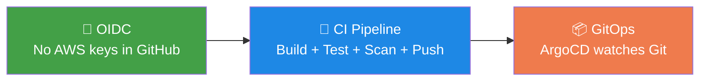
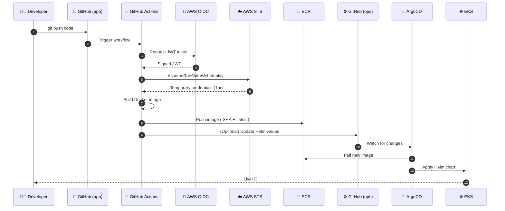
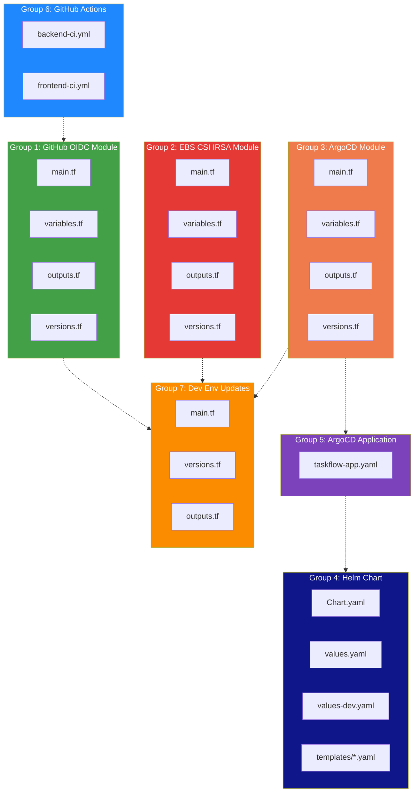
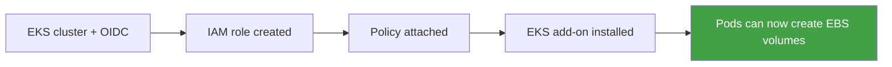
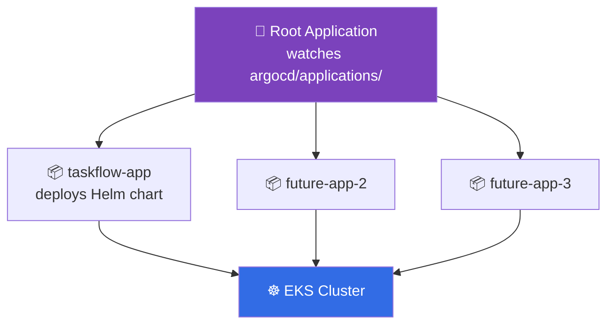
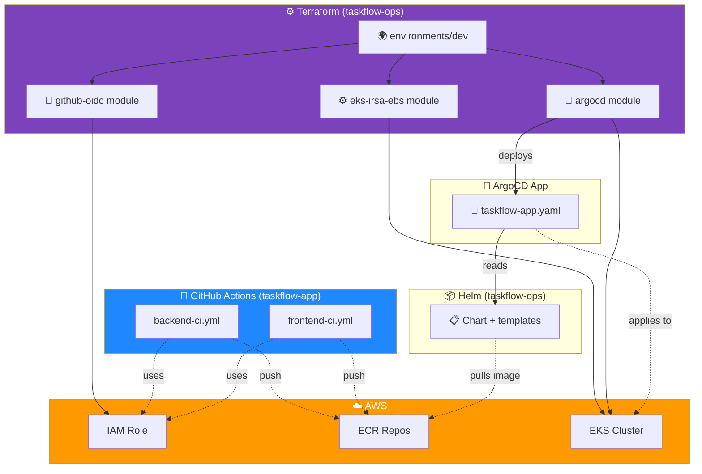

# 🚀 Stage 6b — CI/CD + GitOps Pipeline (Complete File Guide)

> **Every file we created in Stage 6b explained: what it is, why we added it, how it connects to the rest of the system, and what would break without it.**
> Plus the complete pipeline flow, interview prep, and 18-rule compliant documentation.


-43A047)


---

## ⏱️ Time & Cost Estimate

| Phase | Time | Cost (USD) | Cost (INR) |
|-------|------|-----------:|-----------:|
| Read this README | 15 min | $0 | **₹0** |
| PART B — `terraform apply` | ~25 min | ~$0.10 | **~₹8** |
| PART C — Verify cluster | 5 min | ~$0.02 | **~₹2** |
| PART D — Push app → CI → ECR | 5 min | ~$0.02 | **~₹2** |
| PART E — ArgoCD deploys app | 5 min | ~$0.02 | **~₹2** |
| PART F — Verify live + screenshots | 10 min | ~$0.04 | **~₹3** |
| PART G — Test full pipeline | 5 min | ~$0.02 | **~₹2** |
| PART H — `terraform destroy` | 10 min | $0 | **₹0** |
| **Total session** | **~70 min** | **~$0.22** | **~₹19** |
| **After destroy** | — | **$0.10/mo** | **₹8/mo** |

**💡 Baseline: ₹8/month (S3 state only). Session budget: ~₹20.**

---

## 📖 Table of Contents

1. [Business Story — Why CI/CD + GitOps](#1-business-story--why-cicd--gitops)
2. [The Full Pipeline Flow](#2-the-full-pipeline-flow)
3. [File Groups Overview](#3-file-groups-overview)
4. [Group 1: GitHub OIDC Module](#4-group-1-github-oidc-module)
5. [Group 2: EBS CSI IRSA Module](#5-group-2-ebs-csi-irsa-module)
6. [Group 3: ArgoCD Module](#6-group-3-argocd-module)
7. [Group 4: Helm Chart](#7-group-4-helm-chart)
8. [Group 5: ArgoCD Application Manifest](#8-group-5-argocd-application-manifest)
9. [Group 6: GitHub Actions Workflows](#9-group-6-github-actions-workflows)
10. [Group 7: Dev Environment Updates](#10-group-7-dev-environment-updates)
11. [How Everything Interconnects](#11-how-everything-interconnects)
12. [Every File — Full Reference Table](#12-every-file--full-reference-table)
13. [Real-Time Deploy Scenario](#13-real-time-deploy-scenario)
14. [Troubleshooting Guide](#14-troubleshooting-guide)
15. [Root Cause Analysis](#15-root-cause-analysis)
16. [Interview Q&A](#16-interview-qa)
17. [How to Explain in Interview](#17-how-to-explain-in-interview)
18. [Best Practices & Lessons](#18-best-practices--lessons)

---

## 1. Business Story — Why CI/CD + GitOps

### The Problem Before Stage 6b

| Issue | Impact |
|-------|--------|
| Manual `docker build` + `docker push` | Human error on every deploy |
| Long-lived AWS keys in GitHub Secrets | 🔴 Security risk (leaked keys = full account) |
| No audit trail of who deployed what | Can't investigate incidents |
| Manual `kubectl apply` from laptops | Config drift between Git and cluster |
| No rollback strategy | "Just fix it live" = more bugs |
| Deploy time: 15 min manual | Too slow for modern software |

### The Ask

> **"We need automated deployments from Git: push code → deploys to production. No long-lived credentials. Full audit trail. Rollback via Git revert."**

### The Solution — Three Pillars



### Business Outcome

| Metric | Before | After |
|--------|-------|-------|
| Deploy time | 15 min manual | 4 min automated |
| Manual steps per deploy | 8 | **0** |
| AWS keys in GitHub | 1 (bad) | **0 (OIDC)** |
| Rollback | Manual | **`git revert`** |
| Audit trail | None | **Full Git history** |
| MTTR | Hours | Minutes |

---

## 2. The Full Pipeline Flow



### The 7 Stages

| Stage | What | Why |
|-------|------|-----|
| 1️⃣ **Source** | Dev pushes to `taskflow-app` | Triggers pipeline |
| 2️⃣ **Auth** | GitHub Actions assumes IAM role via OIDC | No keys needed |
| 3️⃣ **Build** | Docker image built | Package app |
| 4️⃣ **Push** | Image → ECR with SHA tag | Immutable, traceable |
| 5️⃣ **Watch** | ArgoCD sees change in `taskflow-ops` | GitOps detection |
| 6️⃣ **Deploy** | ArgoCD applies Helm chart | K8s manifests applied |
| 7️⃣ **Verify** | Pods running, health checks pass | Live app |

---

## 3. File Groups Overview



---

## 4. Group 1: GitHub OIDC Module

**Location:** `taskflow-ops/terraform/modules/github-oidc/`

### 📄 `main.tf`

| Field | Value |
|-------|-------|
| 📄 **What** | Creates AWS OIDC provider + IAM role for GitHub Actions |
| ❓ **Why we added it** | Eliminate long-lived AWS keys in GitHub Secrets — a critical security improvement |
| 🎯 **What is its use** | GitHub Actions assumes this role via OIDC federation for temp credentials |
| 📍 **Where it fits** | Terraform module, called from `environments/dev/main.tf` |
| 🔗 **How it connects** | Consumed by `backend-ci.yml` + `frontend-ci.yml` via `role-to-assume` |
| ⚠️ **What breaks without it** | CI can't authenticate to AWS → can't push to ECR |
| 💡 **Real-world analogy** | A visitor badge system — temp access instead of a permanent key |

**Key resources inside:**
- `aws_iam_openid_connect_provider.github` — trusts GitHub's OIDC endpoint
- `aws_iam_role.github_actions` — the role GitHub Actions assumes
- `aws_iam_policy.ecr` — permissions to push/pull ECR images
- `aws_iam_role_policy_attachment.ecr` — wires them together

**Trust policy logic:**

```hcl
Condition = {
  StringEquals = {
    "token.actions.githubusercontent.com:aud" = "sts.amazonaws.com"
  }
  StringLike = {
    "token.actions.githubusercontent.com:sub" = "repo:rakesh-perala/taskflow-app:*"
  }
}
```

**Translation:** "Only GitHub Actions jobs from the `rakesh-perala/taskflow-app` repo can assume this role."

### 📄 `variables.tf`

| Field | Value |
|-------|-------|
| 📄 **What** | Inputs: `project_name`, `environment`, `github_org`, `github_repo`, `tags` |
| ❓ **Why** | Makes module reusable across different repos |
| 🎯 **Use** | Configured per call from dev env |
| 📍 **Where** | Module root |
| 🔗 **Connects** | Consumed by `main.tf` |
| ⚠️ **Without it** | Hardcoded values — not reusable |
| 💡 **Analogy** | A form with blank fields |

### 📄 `outputs.tf`

| Field | Value |
|-------|-------|
| 📄 **What** | Exports `role_arn` and `oidc_provider_arn` |
| ❓ **Why** | We need the role ARN to put in the GitHub Actions workflow |
| 🎯 **Use** | `terraform output github_actions_role_arn` |
| 📍 **Where** | Module output |
| 🔗 **Connects** | Read manually → paste into workflow `ROLE_ARN` |
| ⚠️ **Without it** | Must grep AWS Console |
| 💡 **Analogy** | A receipt with the key info |

### 📄 `versions.tf`

| Field | Value |
|-------|-------|
| 📄 **What** | Pins `aws` and `tls` provider versions |
| ❓ **Why** | Prevent surprise provider upgrades from breaking code |
| 🎯 **Use** | Read during `terraform init` |
| 📍 **Where** | Module root |
| 🔗 **Connects** | Read by Terraform core |
| ⚠️ **Without it** | Silent breakage on provider updates |
| 💡 **Analogy** | `package.json` with pinned deps |

---

## 5. Group 2: EBS CSI IRSA Module

**Location:** `taskflow-ops/terraform/modules/eks-irsa-ebs/`

### 🎯 Why This Module Exists

**Story:** In Stage 5, the EBS CSI add-on **timed out after 20 minutes** because it needed IAM permissions that didn't exist. This module fixes that by creating the IRSA role **BEFORE** the add-on.

### 📄 `main.tf`

| Field | Value |
|-------|-------|
| 📄 **What** | Creates EBS CSI IRSA role + installs the add-on |
| ❓ **Why** | EBS CSI driver needs EC2 permissions to create/modify EBS volumes |
| 🎯 **Use** | Enables dynamic volume provisioning in EKS |
| 📍 **Where** | Terraform module called from dev env |
| 🔗 **Connects** | Consumes `oidc_provider_arn` from EKS module |
| ⚠️ **Without it** | PVCs stay Pending → pods can't mount volumes |
| 💡 **Analogy** | Giving a valet key to a specific parking attendant |

**Key resources:**
- `aws_iam_role.ebs_csi` — IRSA role
- `aws_iam_role_policy_attachment.ebs_csi` — attaches `AmazonEBSCSIDriverPolicy`
- `aws_eks_addon.ebs_csi` — installs the driver with the role attached

**Trust policy (the tricky part):**

```hcl
condition {
  test     = "StringEquals"
  variable = "${var.oidc_issuer_url}:sub"
  values   = ["system:serviceaccount:kube-system:ebs-csi-controller-sa"]
}
```

**Translation:** "Only the pod using the `ebs-csi-controller-sa` ServiceAccount in `kube-system` namespace can assume this role."

**Dependency chain:**



### 📄 `variables.tf`

| Field | Value |
|-------|-------|
| 📄 **What** | `project_name`, `environment`, `cluster_name`, `oidc_provider_arn`, `oidc_issuer_url`, `tags` |
| ❓ **Why** | Needs cluster + OIDC info from EKS module |
| 🎯 **Use** | Wired from `module.eks.*` outputs |
| 📍 **Where** | Module root |
| 🔗 **Connects** | Consumed by `main.tf` |
| ⚠️ **Without it** | Can't build the trust policy |
| 💡 **Analogy** | Sign-in credentials for the role |

### 📄 `outputs.tf`

| Field | Value |
|-------|-------|
| 📄 **What** | `role_arn`, `addon_name` |
| ❓ **Why** | Useful for debugging + status checks |
| 🎯 **Use** | `terraform output module.eks_irsa_ebs.role_arn` |
| 📍 **Where** | Module output |
| 🔗 **Connects** | Informational |
| ⚠️ **Without it** | Harder to debug |
| 💡 **Analogy** | A name badge reference |

### 📄 `versions.tf`

Pins AWS provider. Same pattern as OIDC module.

---

## 6. Group 3: ArgoCD Module

**Location:** `taskflow-ops/terraform/modules/argocd/`

### 📄 `main.tf`

| Field | Value |
|-------|-------|
| 📄 **What** | Installs ArgoCD via Helm + creates root Application |
| ❓ **Why** | We need GitOps engine to auto-deploy from Git |
| 🎯 **Use** | Watches `argocd/applications/` folder in taskflow-ops |
| 📍 **Where** | Terraform module called from dev env |
| 🔗 **Connects** | Uses `kubernetes` + `helm` providers configured in dev env |
| ⚠️ **Without it** | No GitOps → no auto-deploy |
| 💡 **Analogy** | Installing a robot that reads Git and updates the cluster |

**Two key resources:**

**1. `helm_release.argocd`:**
```hcl
resource "helm_release" "argocd" {
  name             = "argocd"
  namespace        = "argocd"
  create_namespace = true
  chart            = "argo-cd"
  version          = "6.7.11"
}
```
Deploys ArgoCD into the `argocd` namespace using the official Helm chart.

**2. `kubernetes_manifest.root_app`:**
```hcl
resource "kubernetes_manifest" "root_app" {
  manifest = {
    kind = "Application"
    metadata = { name = "taskflow-root" }
    spec = {
      source = {
        repoURL = "https://github.com/rakesh-perala/taskflow-ops.git"
        path    = "argocd/applications"
      }
      syncPolicy = { automated = { prune = true, selfHeal = true } }
    }
  }
}
```
Creates a "root Application" that watches `argocd/applications/` in the repo. Any Application manifest found there gets deployed.

**The app-of-apps pattern:**



### 📄 `variables.tf`

| Field | Value |
|-------|-------|
| 📄 **What** | Cluster info + GitHub org/repo |
| ❓ **Why** | Needs cluster endpoint + repo URL |
| 🎯 **Use** | Wired from EKS module + hardcoded org/repo |
| 📍 **Where** | Module root |
| 🔗 **Connects** | Consumed by `main.tf` |
| ⚠️ **Without it** | Can't configure ArgoCD |
| 💡 **Analogy** | Configuration settings |

### 📄 `outputs.tf`

| Field | Value |
|-------|-------|
| 📄 **What** | `argocd_namespace` |
| ❓ **Why** | Useful for kubectl commands |
| 🎯 **Use** | Informational |
| 📍 **Where** | Module output |
| 🔗 **Connects** | Referenced in docs |
| ⚠️ **Without it** | Minor |
| 💡 **Analogy** | A bookmark |

### 📄 `versions.tf`

Pins AWS + Kubernetes + Helm providers.

---

## 7. Group 4: Helm Chart

**Location:** `taskflow-ops/helm/taskflow/`

### 📄 `Chart.yaml`

| Field | Value |
|-------|-------|
| 📄 **What** | Chart metadata (name, version, appVersion) |
| ❓ **Why** | Helm requires it to identify the chart |
| 🎯 **Use** | Read by `helm install` / ArgoCD |
| 📍 **Where** | Chart root |
| 🔗 **Connects** | Used by ArgoCD Application |
| ⚠️ **Without it** | Helm won't install |
| 💡 **Analogy** | A book's title page |

### 📄 `values.yaml`

| Field | Value |
|-------|-------|
| 📄 **What** | Default values for the chart |
| ❓ **Why** | Single source of config; no hardcoding in templates |
| 🎯 **Use** | Image repos, replicas, resources, probes |
| 📍 **Where** | Chart root |
| 🔗 **Connects** | Read by templates |
| ⚠️ **Without it** | Templates have no data → fails |
| 💡 **Analogy** | A restaurant's default menu |

**Key values:**
```yaml
backend:
  image:
    repository: 652310866649.dkr.ecr.ap-south-1.amazonaws.com/taskflow/backend
    tag: latest
  replicas: 2
  resources: { requests: { cpu: 100m, memory: 128Mi } }
  probes: { liveness: { path: /health }, readiness: { path: /ready } }
```

### 📄 `values-dev.yaml`

| Field | Value |
|-------|-------|
| 📄 **What** | Dev-specific overrides |
| ❓ **Why** | Same chart, different env configs |
| 🎯 **Use** | `--values values-dev.yaml` |
| 📍 **Where** | Chart root |
| 🔗 **Connects** | Referenced by ArgoCD Application |
| ⚠️ **Without it** | Must duplicate chart for env |
| 💡 **Analogy** | A seasonal menu |

### 📄 `templates/backend-deployment.yaml`

| Field | Value |
|-------|-------|
| 📄 **What** | K8s Deployment for backend |
| ❓ **Why** | Defines pods, replicas, image, resources, probes |
| 🎯 **Use** | Applied to cluster by ArgoCD |
| 📍 **Where** | Chart templates |
| 🔗 **Connects** | Uses values from `values.yaml` |
| ⚠️ **Without it** | No backend pods |
| 💡 **Analogy** | A recipe for baking the cake |

**Templating example:**
```yaml
image: "{{ .Values.backend.image.repository }}:{{ .Values.backend.image.tag }}"
replicas: {{ .Values.backend.replicas }}
```

**What this means:** Values from `values.yaml` get injected into the template.

### 📄 `templates/backend-service.yaml`

| Field | Value |
|-------|-------|
| 📄 **What** | K8s Service (ClusterIP) for backend |
| ❓ **Why** | Gives backend pods a stable DNS name + virtual IP |
| 🎯 **Use** | Frontend/ingress calls `taskflow-backend.namespace.svc.cluster.local` |
| 📍 **Where** | Chart templates |
| 🔗 **Connects** | Selected by label `app: taskflow-backend` |
| ⚠️ **Without it** | Pods not reachable from other services |
| 💡 **Analogy** | A phone number for the backend |

### 📄 `templates/frontend-deployment.yaml` + `frontend-service.yaml`

Same as backend — but for the React frontend. Frontend serves on port 80.

### 📄 `templates/NOTES.txt`

| Field | Value |
|-------|-------|
| 📄 **What** | Help text printed after `helm install` |
| ❓ **Why** | Tells user how to access the app |
| 🎯 **Use** | Info only |
| 📍 **Where** | Chart templates |
| 🔗 **Connects** | Shown by Helm CLI |
| ⚠️ **Without it** | Cosmetically bad |
| 💡 **Analogy** | A welcome card |

**Content:**
```
TaskFlow deployed to {{ .Values.namespace }}.
Port-forward: kubectl port-forward -n {{ .Values.namespace }} svc/taskflow-frontend 8080:80
```

---

## 8. Group 5: ArgoCD Application Manifest

**Location:** `taskflow-ops/argocd/applications/taskflow-app.yaml`

### 📄 `taskflow-app.yaml`

| Field | Value |
|-------|-------|
| 📄 **What** | ArgoCD Application CR — declares "deploy Helm chart taskflow to EKS" |
| ❓ **Why** | GitOps needs a declarative "what to deploy" file |
| 🎯 **Use** | Watched by ArgoCD root app; triggers sync |
| 📍 **Where** | `argocd/applications/` (watched folder) |
| 🔗 **Connects** | Root ArgoCD app → this file → Helm chart → cluster |
| ⚠️ **Without it** | ArgoCD doesn't know what to deploy |
| 💡 **Analogy** | An order form for the factory |

**Full manifest:**
```yaml
apiVersion: argoproj.io/v1alpha1
kind: Application
metadata:
  name: taskflow-app
  namespace: argocd
spec:
  project: default
  source:
    repoURL: https://github.com/rakesh-perala/taskflow-ops.git
    targetRevision: main
    path: helm/taskflow                # Points to Helm chart
    helm:
      valueFiles:
        - values.yaml
  destination:
    server: https://kubernetes.default.svc
    namespace: taskflow-dev
  syncPolicy:
    automated:
      prune: true                      # Delete removed resources
      selfHeal: true                   # Fix manual drift
    syncOptions:
      - CreateNamespace=true
      - ServerSideApply=true
```

**What this does:**
1. Reads Helm chart at `helm/taskflow/` from `taskflow-ops` repo
2. Applies it to `taskflow-dev` namespace in the same cluster
3. Auto-syncs on every Git change
4. Self-heals if someone manually changes the cluster
5. Prunes deleted resources

---

## 9. Group 6: GitHub Actions Workflows

**Location:** `taskflow-app/.github/workflows/`

### 📄 `backend-ci.yml`

| Field | Value |
|-------|-------|
| 📄 **What** | CI pipeline: build + test + scan + push backend image |
| ❓ **Why** | Automate builds; no manual docker commands |
| 🎯 **Use** | Triggers on push to `main` when `backend/**` changes |
| 📍 **Where** | `.github/workflows/` |
| 🔗 **Connects** | OIDC role → ECR push |
| ⚠️ **Without it** | Manual builds = errors |
| 💡 **Analogy** | An assembly line for backend |

**Workflow steps:**
1. Checkout code
2. Setup Node.js 20
3. `npm ci` + `npm run build`
4. Configure AWS via OIDC (using the role from Group 1)
5. Login to ECR
6. Build Docker image
7. Push with 2 tags: `:$GIT_SHA` + `:latest`
8. Cache build layers in GitHub Actions cache

**Key section — OIDC auth:**
```yaml
- name: Configure AWS (OIDC)
  uses: aws-actions/configure-aws-credentials@v4
  with:
    role-to-assume: arn:aws:iam::652310866649:role/taskflow-dev-github-actions-role
    aws-region: ap-south-1
```

**Note:** `role-to-assume` matches the `role_arn` output of the GitHub OIDC module.

### 📄 `frontend-ci.yml`

Same pattern as backend, but:
- Working directory: `frontend/`
- ECR repo: `taskflow/frontend`
- Node build uses Vite

---

## 10. Group 7: Dev Environment Updates

**Location:** `taskflow-ops/terraform/environments/dev/`

### 🔧 `versions.tf` (Modified)

| Field | Value |
|-------|-------|
| 📄 **What** | Added `kubernetes` and `helm` providers |
| ❓ **Why** | ArgoCD module needs them to talk to the cluster |
| 🎯 **Use** | Declared at provider block level |
| 📍 **Where** | Dev env root |
| 🔗 **Connects** | Used by ArgoCD module |
| ⚠️ **Without it** | ArgoCD install fails |
| 💡 **Analogy** | Adding new language support |

**Added:**
```hcl
kubernetes = { source = "hashicorp/kubernetes", version = "~> 2.27" }
helm       = { source = "hashicorp/helm", version = "~> 2.12" }
```

### 🔧 `main.tf` (Modified)

| Field | Value |
|-------|-------|
| 📄 **What** | Appended 3 new module calls + 2 providers |
| ❓ **Why** | Wire up new infra pieces |
| 🎯 **Use** | `terraform apply` reads this |
| 📍 **Where** | Dev env root |
| 🔗 **Connects** | Modules + providers |
| ⚠️ **Without it** | New modules never created |
| 💡 **Analogy** | Wiring new rooms into a house blueprint |

**Appended:**
- `module "github_oidc"` — creates OIDC role
- `module "eks_irsa_ebs"` — EBS CSI IRSA
- `data "aws_eks_cluster_auth"` + `provider "kubernetes"` + `provider "helm"` — cluster auth
- `module "argocd"` — installs ArgoCD

### 🔧 `outputs.tf` (Modified)

| Field | Value |
|-------|-------|
| 📄 **What** | Exposes `github_actions_role_arn` |
| ❓ **Why** | Needed to update GitHub Actions workflows |
| 🎯 **Use** | `terraform output github_actions_role_arn` |
| 📍 **Where** | Dev env output |
| 🔗 **Connects** | Read manually → paste into workflows |
| ⚠️ **Without it** | Must find ARN in AWS Console |
| 💡 **Analogy** | A summary report |

---

## 11. How Everything Interconnects

### Full Dependency Graph



### Connection Table

| From | To | Purpose |
|------|-----|---------|
| Dev env | OIDC module | Create IAM role for GitHub |
| Dev env | EBS IRSA module | Create EBS CSI role + addon |
| Dev env | ArgoCD module | Install ArgoCD |
| OIDC module | IAM Role | Grant GitHub Actions ECR access |
| EBS IRSA module | EKS cluster | Attach addon with role |
| ArgoCD module | EKS cluster | Install via Helm |
| ArgoCD root app | `argocd/applications/` | Watch for app manifests |
| `taskflow-app.yaml` | Helm chart | Reference `helm/taskflow/` |
| Helm chart | ECR | Pull images |
| Helm chart | EKS | Apply deployments |
| Backend CI | IAM Role (via OIDC) | Authenticate |
| Backend CI | ECR | Push backend image |
| Frontend CI | IAM Role (via OIDC) | Authenticate |
| Frontend CI | ECR | Push frontend image |

### The Data Flow (Non-Technical)


---

## 12. Every File — Full Reference Table

| # | File | Group | What | Why | Where | Connects To | Without It |
|---|------|-------|------|-----|-------|-------------|------------|
| 1 | `github-oidc/main.tf` | OIDC | OIDC provider + IAM role | No AWS keys | Module | workflows | CI fails auth |
| 2 | `github-oidc/variables.tf` | OIDC | Inputs | Reusability | Module | main.tf | Hardcoded |
| 3 | `github-oidc/outputs.tf` | OIDC | Exports role ARN | Wire to workflows | Module | workflows | Manual lookup |
| 4 | `github-oidc/versions.tf` | OIDC | Provider versions | Stability | Module | Terraform init | Breakage |
| 5 | `eks-irsa-ebs/main.tf` | IRSA | EBS CSI role + addon | Fix timeout | Module | EKS cluster | PVC failures |
| 6 | `eks-irsa-ebs/variables.tf` | IRSA | Cluster + OIDC info | Config | Module | main.tf | Can't wire |
| 7 | `eks-irsa-ebs/outputs.tf
