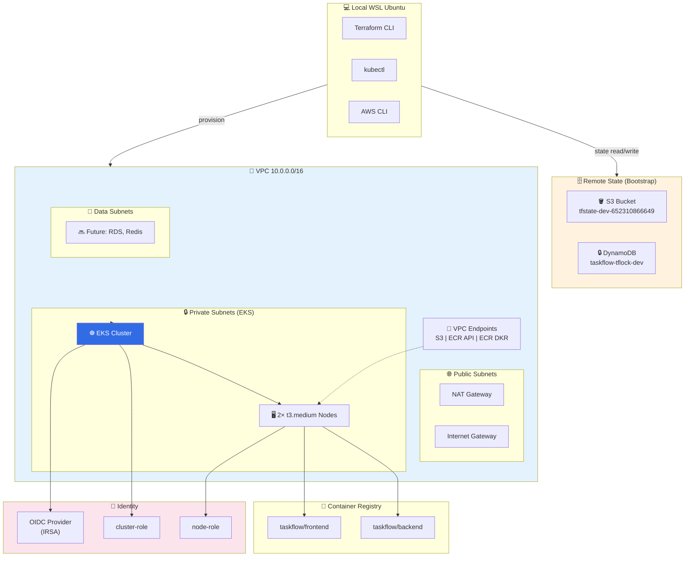
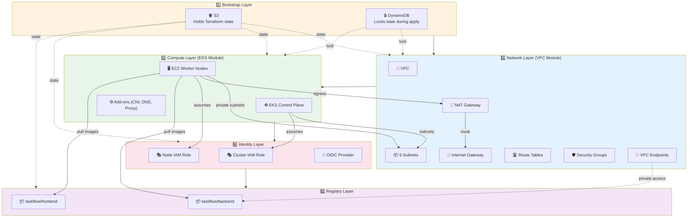
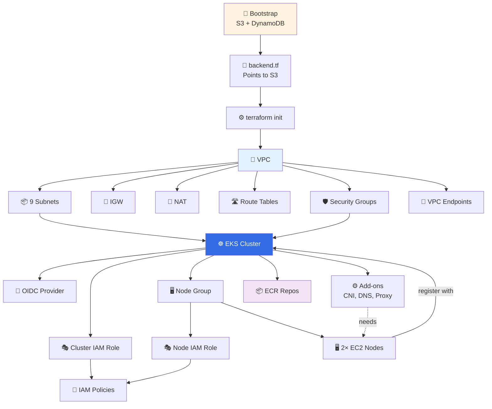
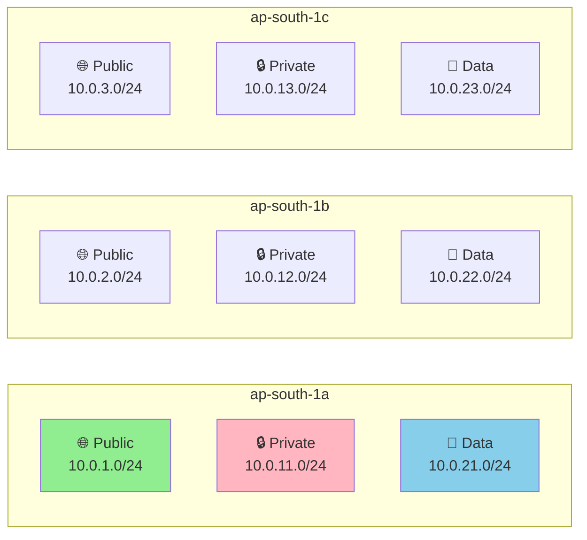
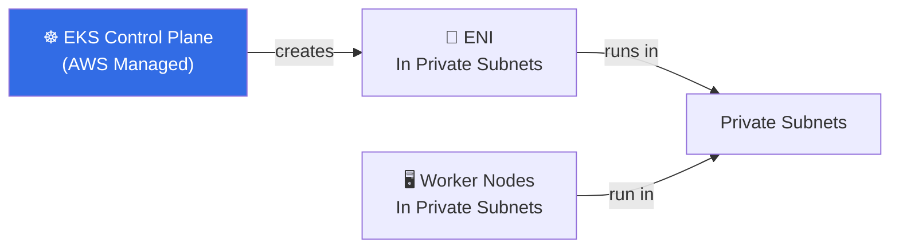
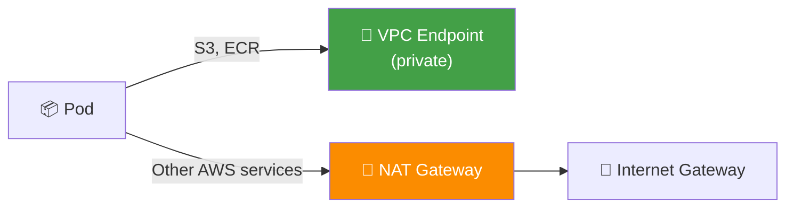
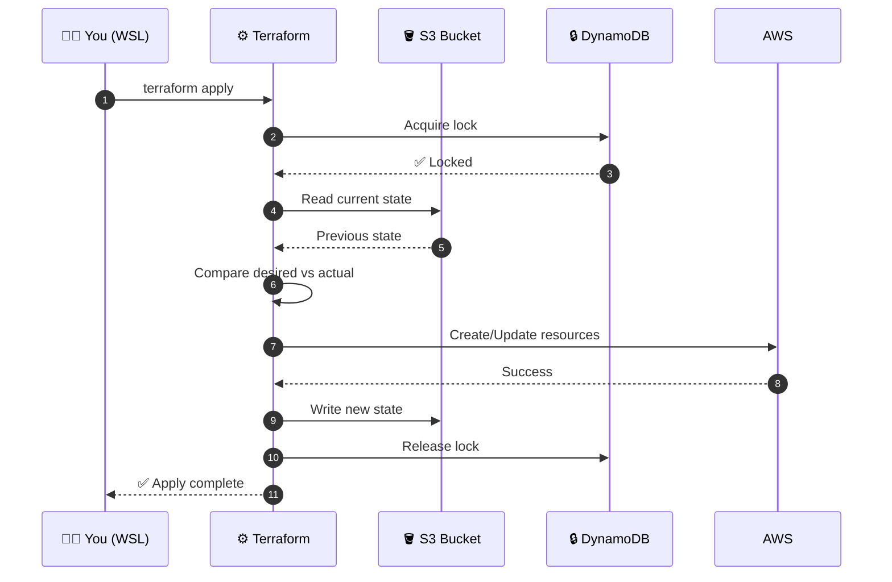
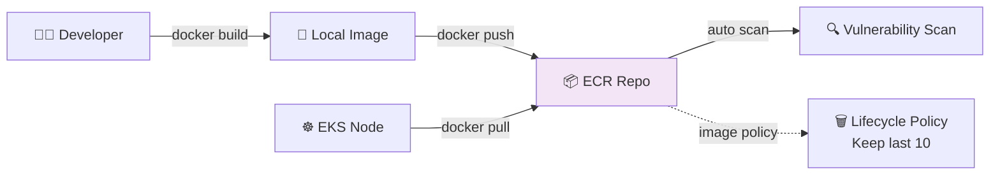
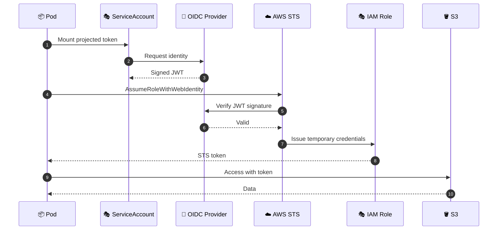

# ⚙️ TaskFlow Ops — Terraform Infrastructure (Stage 1–5 Complete)

> **Production-grade AWS infrastructure for TaskFlow — bootstrapped with Terraform from scratch.**
> Multi-AZ VPC, EKS cluster, ECR registries, IRSA, VPC endpoints — all as code, fully documented.


---

## 📖 Table of Contents

1. [What This Repo Is](#1-what-this-repo-is)
2. [Business Story — Why We Built This](#2-business-story--why-we-built-this)
3. [What We Built — High-Level View](#3-what-we-built--high-level-view)
4. [Architecture — How Everything Connects](#4-architecture--how-everything-connects)
5. [Every File — What, Why, Where](#5-every-file--what-why-where)
6. [Resource Dependency Graph](#6-resource-dependency-graph)
7. [How VPC Was Created — Deep Dive](#7-how-vpc-was-created--deep-dive)
8. [How EKS Connects to VPC — Deep Dive](#8-how-eks-connects-to-vpc--deep-dive)
9. [How S3 Holds Terraform State — Deep Dive](#9-how-s3-holds-terraform-state--deep-dive)
10. [How ECR Stores Images — Deep Dive](#10-how-ecr-stores-images--deep-dive)
11. [How IRSA Works — Deep Dive](#11-how-irsa-works--deep-dive)
12. [Live Verification — Real Commands & Outputs](#12-live-verification--real-commands--outputs)
13. [Deployment Timeline — What Happened When](#13-deployment-timeline--what-happened-when)
14. [Real-Time Issues We Hit & Fixed](#14-real-time-issues-we-hit--fixed)
15. [Cost Breakdown & Teardown](#15-cost-breakdown--teardown)
16. [Next Stage Preview](#16-next-stage-preview)
17. [Interview Questions & Answers](#17-interview-questions--answers)
18. [How to Explain in Interview](#18-how-to-explain-in-interview)
19. [Best Practices & Lessons](#19-best-practices--lessons)

---

## 1. What This Repo Is

**`taskflow-ops`** is the **operations repository** for the TaskFlow project — a lightweight, enterprise-style task management SaaS. It owns:

- ✅ Infrastructure as Code (Terraform)
- ✅ AWS resource provisioning
- ✅ Kubernetes cluster lifecycle
- ✅ Container registries (ECR)
- ✅ Networking, IAM, security groups
- ✅ Remote state management

**Companion repo:** [`taskflow-app`](https://github.com/rakesh-perala/taskflow-app) — the app code (React + Node.js).

---

## 2. Business Story — Why We Built This

### The Problem

TaskFlow started as a simple side project. But to demonstrate **real DevOps skills** (and survive an interview), we needed **real infrastructure**:

| Problem | Impact |
|---------|--------|
| Local-only development | Can't demo at scale |
| No reproducible environment | "Works on my laptop" |
| No cloud experience | Missing 60% of DevOps job requirements |
| Manual AWS clicks | Not auditable, not repeatable |
| No cost discipline | AWS bill surprises |

### The Ask

> "Build a **reproducible**, **multi-AZ**, **production-grade** AWS infrastructure using **Terraform only** — no manual clicks — and document every decision."

### Success Metrics

| Metric | Target | Achieved |
|--------|--------|----------|
| Everything as code | 100% | ✅ 100% |
| Reproducible from scratch | Yes | ✅ `terraform apply` |
| Multi-AZ HA | 3 AZs | ✅ ap-south-1a/b/c |
| Cost-optimized | Dev env | ✅ Single NAT |
| State-safe | Remote + locked | ✅ S3 + DynamoDB |
| Security baseline | IRSA, private subnets | ✅ Implemented |

---

## 3. What We Built — High-Level View



### Summary of Resources Created

| Resource Type | Count | Purpose |
|---------------|:-----:|---------|
| S3 Buckets | 1 | Terraform state |
| DynamoDB Tables | 1 | State locking |
| VPCs | 1 | Network isolation |
| Subnets | 9 | 3 public + 3 private + 3 data |
| Internet Gateway | 1 | Public internet access |
| NAT Gateway | 1 | Private subnet egress |
| Elastic IPs | 1 | NAT Gateway IP |
| Route Tables | 4 | Public + private + data routing |
| Route Table Associations | 9 | Subnet-to-RT binding |
| Security Groups | 2 | Cluster + VPC endpoints |
| VPC Endpoints | 3 | S3, ECR API, ECR DKR |
| EKS Cluster | 1 | Managed K8s control plane |
| EKS Node Groups | 1 | 2× t3.medium workers |
| EKS Add-ons | 3 | vpc-cni, coredns, kube-proxy |
| IAM Roles | 2 | Cluster + node |
| IAM Policy Attachments | 5 | AWS-managed policies |
| IAM OIDC Provider | 1 | IRSA foundation |
| ECR Repositories | 2 | backend + frontend images |
| ECR Lifecycle Policies | 2 | Keep last 10 images |
| **Total** | **~50** | **Everything as code** |

---

## 4. Architecture — How Everything Connects

### Layer-by-Layer Connection



### The "Who Talks To Whom" Table

| Source | Destination | Protocol | Why |
|--------|-------------|----------|-----|
| Terraform CLI | S3 | HTTPS | Read/write state |
| Terraform CLI | DynamoDB | HTTPS | Acquire state lock |
| Terraform CLI | AWS APIs | HTTPS | Provision resources |
| EKS Control Plane | Private Subnets | ENI | Run cluster ENIs |
| EKS Control Plane | IAM Role | Assume | Permissions |
| Worker Nodes | EKS Control Plane | HTTPS | Join cluster |
| Worker Nodes | NAT Gateway | TCP/UDP | Outbound internet |
| NAT Gateway | Internet Gateway | IP | Route to internet |
| Worker Nodes | ECR | HTTPS | Pull container images |
| Worker Nodes | VPC Endpoint (S3) | HTTPS | Private S3 access |
| kubectl | EKS API | HTTPS | Cluster management |
| You (browser) | AWS Console | HTTPS | Visual verification |

---

## 5. Every File — What, Why, Where

### Repository Structure

```
taskflow-ops/
├── terraform/
│   ├── bootstrap/                    # 🔨 State backend setup
│   │   ├── main.tf                   # S3 + DynamoDB creation
│   │   ├── variables.tf              # Input variables
│   │   └── outputs.tf                # State bucket name etc.
│   ├── modules/                      # 📦 Reusable modules
│   │   ├── vpc/
│   │   │   ├── main.tf               # VPC, subnets, NAT, endpoints
│   │   │   ├── variables.tf          # Module inputs
│   │   │   ├── outputs.tf            # Module outputs
│   │   │   └── versions.tf           # Provider constraints
│   │   └── eks/
│   │       ├── main.tf               # Cluster, nodes, add-ons, ECR
│   │       ├── variables.tf          # Module inputs
│   │       ├── outputs.tf            # Module outputs
│   │       └── versions.tf           # Provider constraints
│   └── environments/
│       └── dev/                      # 🌍 Dev environment
│           ├── main.tf               # Wires VPC + EKS modules
│           ├── backend.tf            # S3 backend config
│           ├── variables.tf          # Env inputs
│           ├── versions.tf           # Provider constraints
│           └── outputs.tf            # Env outputs
├── .gitignore                        # Ignores state, plans, secrets
├── README.md                         # You are here
└── LICENSE                           # MIT
```

### File-by-File Documentation

#### `terraform/bootstrap/main.tf`

| Field | Value |
|-------|-------|
| 📄 **What** | Creates the S3 bucket and DynamoDB table that store Terraform's state |
| ❓ **Why we added it** | Terraform needs a durable, shared, lockable place for state |
| 🎯 **What is its use** | Runs once, sets up state infrastructure for all other stacks |
| 📍 **Where it fits** | Runs BEFORE anything else; everything else depends on it |
| 🔗 **How it connects** | Creates resources that `environments/dev/backend.tf` points to |
| ⚠️ **What breaks without it** | All other Terraform configs fail — no place to store state |
| 💡 **Real-world analogy** | Like creating a filing cabinet before writing any documents |

#### `terraform/bootstrap/variables.tf`

| Field | Value |
|-------|-------|
| 📄 **What** | Input variables (region, project name, environment) |
| ❓ **Why we added it** | Avoids hardcoding; makes bootstrap reusable |
| 🎯 **What is its use** | Configures bucket name prefix and region |
| 📍 **Where it fits** | Root of bootstrap module |
| 🔗 **How it connects** | Consumed by `main.tf` |
| ⚠️ **What breaks without it** | Would need hardcoded values everywhere |
| 💡 **Real-world analogy** | Like a settings file for a script |

#### `terraform/bootstrap/outputs.tf`

| Field | Value |
|-------|-------|
| 📄 **What** | Exposes S3 bucket name, DynamoDB table name, account ID |
| ❓ **Why we added it** | You need these values to configure other stacks |
| 🎯 **What is its use** | Copy-paste into `environments/dev/backend.tf` |
| 📍 **Where it fits** | Output of bootstrap module |
| 🔗 **How it connects** | Read by humans, used manually |
| ⚠️ **What breaks without it** | You'd grep AWS Console for bucket names |
| 💡 **Real-world analogy** | Like a receipt with the details you need |

#### `terraform/modules/vpc/main.tf`

| Field | Value |
|-------|-------|
| 📄 **What** | Creates VPC, 9 subnets, IGW, NAT, route tables, SGs, VPC endpoints |
| ❓ **Why we added it** | EKS needs a dedicated network with public/private/data isolation |
| 🎯 **What is its use** | Provides the network foundation for everything else |
| 📍 **Where it fits** | Called by `environments/dev/main.tf` |
| 🔗 **How it connects** | Outputs subnet IDs to EKS module |
| ⚠️ **What breaks without it** | No networking = no cluster = no app |
| 💡 **Real-world analogy** | Like building roads, intersections, and gates for a new city |

#### `terraform/modules/eks/main.tf`

| Field | Value |
|-------|-------|
| 📄 **What** | EKS cluster, node group, add-ons, IAM roles, IRSA, ECR repos |
| ❓ **Why we added it** | Managed K8s is the standard for running containerized apps |
| 🎯 **What is its use** | Provides compute + registry + identity for TaskFlow |
| 📍 **Where it fits** | Called by `environments/dev/main.tf`, depends on VPC |
| 🔗 **How it connects** | Consumes private subnet IDs from VPC; outputs cluster name/endpoint |
| ⚠️ **What breaks without it** | No place to run pods |
| 💡 **Real-world analogy** | Like the actual factory inside the industrial park |

#### `terraform/environments/dev/main.tf`

| Field | Value |
|-------|-------|
| 📄 **What** | Root module that wires VPC + EKS together |
| ❓ **Why we added it** | Each environment (dev/staging/prod) should have its own composition |
| 🎯 **What is its use** | Defines how modules connect for dev |
| 📍 **Where it fits** | Entry point for `terraform apply` in dev |
| 🔗 **How it connects** | Reads module outputs, passes them as inputs |
| ⚠️ **What breaks without it** | No way to compose modules |
| 💡 **Real-world analogy** | Like a blueprint that combines plumbing, electrical, and HVAC |

#### `terraform/environments/dev/backend.tf`

| Field | Value |
|-------|-------|
| 📄 **What** | S3 backend configuration |
| ❓ **Why we added it** | Tell Terraform WHERE to store state |
| 🎯 **What is its use** | Points to the S3 bucket created in bootstrap |
| 📍 **Where it fits** | Configured during `terraform init` |
| 🔗 **How it connects** | Links local Terraform to remote S3 state |
| ⚠️ **What breaks without it** | State saved locally → dangerous |
| 💡 **Real-world analogy** | Like telling Google Docs where to save your file |

#### `terraform/modules/*/versions.tf`

| Field | Value |
|-------|-------|
| 📄 **What** | Pins Terraform + provider versions |
| ❓ **Why we added it** | Prevents surprise upgrades |
| 🎯 **What is its use** | Guarantees reproducible installs |
| 📍 **Where it fits** | Root of every module |
| 🔗 **How it connects** | Read by `terraform init` |
| ⚠️ **What breaks without it** | Provider upgrades break code silently |
| 💡 **Real-world analogy** | Like pinning package.json versions in Node.js |

#### `.gitignore`

| Field | Value |
|-------|-------|
| 📄 **What** | Ignores state files, plans, secrets |
| ❓ **Why we added it** | **Never commit state or secrets to Git** |
| 🎯 **What is its use** | Protects against accidental leaks |
| 📍 **Where it fits** | Repo root |
| 🔗 **How it connects** | Read by Git on every commit |
| ⚠️ **What breaks without it** | AWS keys and infra details leak to GitHub |
| 💡 **Real-world analogy** | Like a "do not mail" list for sensitive documents |

---

## 6. Resource Dependency Graph



### Key Dependency Rules

| Rule | Why |
|------|-----|
| S3 must exist before any `terraform apply` | State needs a home |
| VPC must exist before EKS | EKS needs subnets |
| IAM roles must exist before EKS | EKS assumes roles |
| OIDC must exist before IRSA-enabled add-ons | Add-ons need identity |
| Node group must exist before add-ons like CoreDNS | Add-ons run ON nodes |
| ECR must exist before image push | Registry needed first |

---

## 7. How VPC Was Created — Deep Dive

### Step 1 — VPC Itself

```hcl
resource "aws_vpc" "main" {
  cidr_block           = "10.0.0.0/16"
  enable_dns_hostnames = true
  enable_dns_support   = true
}
```

**Why `10.0.0.0/16`?** 65,536 IPs — enough for future growth without re-architecting. RFC 1918 private range.

**Why DNS enabled?** EKS needs DNS resolution for service discovery.

**Result:** `vpc-0a0b220fd4141f5af`

### Step 2 — Subnets (3 Tiers × 3 AZs)



**Why 3 tiers?**

| Tier | Purpose | What Runs Here |
|------|---------|----------------|
| **Public** | Internet-facing | ALB, NAT, Bastion |
| **Private** | Workloads | EKS nodes, pods |
| **Data** | Databases | RDS, ElastiCache (future) |

**Why 3 AZs?** AWS best practice — survive single-AZ outage.

### Step 3 — Internet Gateway + NAT

```hcl
resource "aws_internet_gateway" "main" { ... }   # For public subnets
resource "aws_eip" "nat" { ... }                  # Static IP for NAT
resource "aws_nat_gateway" "main" { ... }         # Outbound for private
```

**Single NAT for dev** = saves ~$35/mo. In prod, use one per AZ.

### Step 4 — Route Tables

| Route Table | Attached To | Route |
|-------------|-------------|-------|
| Public RT | 3 public subnets | 0.0.0.0/0 → IGW |
| Private RT (×3) | 3 private subnets | 0.0.0.0/0 → NAT |
| Data RT (×3) | 3 data subnets | 0.0.0.0/0 → NAT |

### Step 5 — VPC Endpoints (Cost Optimization)

```hcl
resource "aws_vpc_endpoint" "s3" { ... }           # Gateway
resource "aws_vpc_endpoint" "ecr_api" { ... }      # Interface
resource "aws_vpc_endpoint" "ecr_dkr" { ... }      # Interface
```

**Why?** Saves NAT data transfer costs for ECR pulls — a HUGE savings in busy clusters.

---

## 8. How EKS Connects to VPC — Deep Dive

### The Critical Wiring

```hcl
module "eks" {
  source             = "../../modules/eks"
  vpc_id             = module.vpc.vpc_id
  private_subnet_ids = module.vpc.private_subnet_ids
  ...
}
```

**This single line is the handshake:** EKS gets the VPC ID + the 3 private subnet IDs.

### How EKS Uses the VPC



### Step-by-Step Connection

| Step | What Happens |
|------|--------------|
| 1 | Terraform reads `private_subnet_ids` from VPC module output |
| 2 | Passes them to `aws_eks_cluster.main` as `subnet_ids` |
| 3 | EKS creates ENIs (Elastic Network Interfaces) in those subnets |
| 4 | EKS control plane uses ENIs to communicate with worker nodes |
| 5 | Worker nodes are launched in the same subnets by node group |
| 6 | All traffic stays in private network — no internet exposure |

### Why Private Subnets for EKS?

| Reason | Why |
|--------|-----|
| Security | No direct internet access to nodes |
| Compliance | PCI-DSS, SOC2 require isolated workloads |
| Cost | No public IPs on every node |
| Controlled egress | All outbound goes via NAT (auditable) |

### How Pods Talk to AWS Services

Two paths:



**Best practice:** Use VPC endpoints for AWS services whenever possible.

---

## 9. How S3 Holds Terraform State — Deep Dive

### The State Lifecycle



### Why S3 + DynamoDB?

| Component | Purpose | Why |
|-----------|---------|-----|
| **S3** | Store state file | Durable, versioned, encrypted, cheap |
| **DynamoDB** | State locking | Prevents concurrent `apply` corrupting state |

### What's Actually Inside the State File?

The state file tracks:
- Every resource created
- Resource IDs (vpc-xxx, subnet-yyy)
- Current attribute values
- Dependency graph

**It's Terraform's memory.** Delete it → Terraform forgets everything.

### Versioning + Encryption

```hcl
resource "aws_s3_bucket_versioning" "tfstate" {
  versioning_configuration { status = "Enabled" }
}

resource "aws_s3_bucket_server_side_encryption_configuration" "tfstate" {
  rule {
    apply_server_side_encryption_by_default {
      sse_algorithm = "AES256"
    }
  }
}
```

**Why?**
- **Versioning:** Recover from accidental state corruption
- **Encryption:** State contains sensitive info (passwords, keys)

---

## 10. How ECR Stores Images — Deep Dive

### The Flow



### What We Created

```hcl
resource "aws_ecr_repository" "backend" {
  name                 = "taskflow/backend"
  image_tag_mutability = "MUTABLE"
  image_scanning_configuration { scan_on_push = true }
  encryption_configuration { encryption_type = "AES256" }
}

resource "aws_ecr_repository" "frontend" {
  name                 = "taskflow/frontend"
  image_tag_mutability = "MUTABLE"
  image_scanning_configuration { scan_on_push = true }
  encryption_configuration { encryption_type = "AES256" }
}
```

### Why These Settings?

| Setting | Why |
|---------|-----|
| `scan_on_push` | Auto-scan every image for CVEs |
| `AES256` | Encrypt at rest (compliance) |
| `MUTABLE` | Allow overwriting tags like `latest` |
| Lifecycle (keep 10) | Prevent runaway storage costs |

### Why ECR Over Docker Hub?

| Reason | Benefit |
|--------|---------|
| Private by default | Security |
| IAM integration | No separate credentials |
| Same-region pulls | Fast + cheap |
| Image scanning | Built-in security |
| VPC endpoints | No NAT cost |

---

## 11. How IRSA Works — Deep Dive

**IRSA** = IAM Roles for Service Accounts. It's how a **pod** gets AWS permissions — without giving the whole node permissions.

### The Problem IRSA Solves

**Bad way:** Give every EC2 node in the cluster full S3 access. Every pod on that node now has S3 access. 😱

**IRSA way:** Give a **specific ServiceAccount** (used by a specific pod) the permission. Other pods unaffected. ✅

### How It Works



### What We Created

```hcl
resource "aws_iam_openid_connect_provider" "cluster" {
  client_id_list  = ["sts.amazonaws.com"]
  thumbprint_list = [data.tls_certificate.cluster.certificates[0].sha1_fingerprint]
  url             = aws_eks_cluster.main.identity[0].oidc[0].issuer
}
```

**This creates the trust relationship between EKS and AWS IAM.**

### Why This Matters for TaskFlow

| Future Need | IRSA Will Provide |
|-------------|-------------------|
| EBS CSI driver | Permission to create/modify EBS volumes |
| External Secrets Operator | Read from AWS Secrets Manager |
| Cert Manager | Route53 DNS challenge |
| App pods | Read/write S3 buckets |
| Cluster Autoscaler | Modify Auto Scaling Groups |

**Right now:** We created the OIDC provider but haven't attached any IAM roles yet. That's Stage 6.

---

## 12. Live Verification — Real Commands & Outputs

### Verify Cluster

```bash
aws eks describe-cluster --name taskflow-dev --region ap-south-1 --query 'cluster.status'
# "ACTIVE"
```

### Verify Nodes

```bash
kubectl get nodes
```

**Output:**
```
NAME                                         STATUS   ROLES    AGE   VERSION
ip-10-0-12-112.ap-south-1.compute.internal   Ready    <none>   42m   v1.33.13-eks-3b4a6ca
ip-10-0-13-97.ap-south-1.compute.internal    Ready    <none>   42m   v1.33.13-eks-3b4a6ca
```

### Verify System Pods

```bash
kubectl get pods -A
```

**Output:**
```
NAMESPACE     NAME                       READY   STATUS    RESTARTS   AGE
kube-system   aws-node-88c2w             2/2     Running   0          42m
kube-system   aws-node-vsc9l             2/2     Running   0          42m
kube-system   coredns-5b8fb9bd9f-fb8fn   1/1     Running   0          42m
kube-system   coredns-5b8fb9bd9f-hn2kz   1/1     Running   0          42m
kube-system   kube-proxy-c5rbr           1/1     Running   0          42m
kube-system   kube-proxy-qtzt7           1/1     Running   0          42m
```

### Verify ECR

```bash
aws ecr describe-repositories --region ap-south-1 --query 'repositories[].repositoryName'
# ["taskflow/backend", "taskflow/frontend"]
```

### Verify Add-ons

```bash
aws eks list-addons --cluster-name taskflow-dev --region ap-south-1
# {"addons": ["coredns", "kube-proxy", "vpc-cni"]}
```

---

## 13. Deployment
