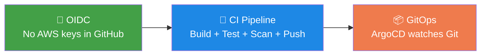
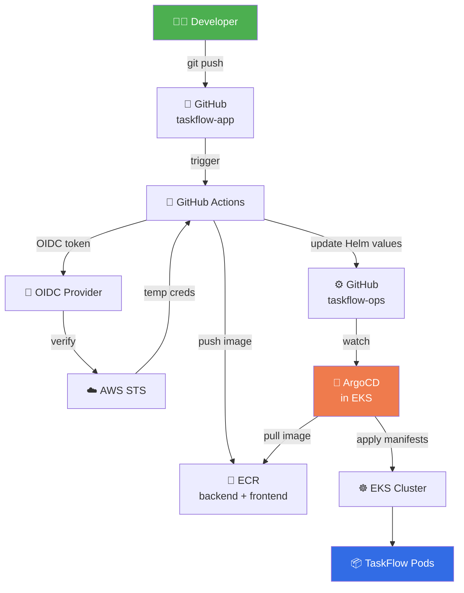

# 🚀 Stage 6b — CI/CD + GitOps Pipeline (Full README)

> **Automated CI/CD with GitHub OIDC, ECR, Helm, and ArgoCD — deploy TaskFlow to EKS via GitOps.**
> Zero long-lived AWS keys. Zero manual kubectl. Pure enterprise-grade automation.


-43A047)


---

## ⏱️ Time & Cost Estimate

| Phase | Time | Cost |
|-------|------|------|
| Write GitHub Actions workflows | 10 min | $0 |
| Write Terraform OIDC + ArgoCD modules | 15 min | $0 |
| Write Helm chart | 10 min | $0 |
| Write ArgoCD Application manifests | 5 min | $0 |
| `terraform apply` (recreate infra) | ~15 min | ~$0.06 |
| Push first commit → CI builds → ECR | ~5 min | ~$0.02 |
| ArgoCD deploy to EKS | ~5 min | ~$0.02 |
| Verify + screenshots | ~10 min | ~$0.04 |
| **Total (this session)** | **~75 min** | **~$0.14** |
| **Monthly (if left running)** | — | **~$180/mo** |
| **Monthly (after destroy)** | — | **~$0.10/mo** |

**⚠️ After verification → run `terraform destroy` to drop cost back to $0.10/mo.**

---

## 📖 Table of Contents

1. [Business Story](#1-business-story)
2. [Architecture — Full Picture](#2-architecture--full-picture)
3. [Every File — What, Why, Where](#3-every-file--what-why-where)
4. [Step 1: GitHub OIDC Module (Terraform)](#4-step-1-github-oidc-module-terraform)
5. [Step 2: ArgoCD Module (Terraform)](#5-step-2-argocd-module-terraform)
6. [Step 3: EBS CSI with IRSA (Fixed!)](#6-step-3-ebs-csi-with-irsa-fixed)
7. [Step 4: GitHub Actions Workflows](#7-step-4-github-actions-workflows)
8. [Step 5: Helm Chart](#8-step-5-helm-chart)
9. [Step 6: ArgoCD Application Manifests](#9-step-6-argocd-application-manifests)
10. [Step 7: Recreate Infrastructure](#10-step-7-recreate-infrastructure)
11. [Step 8: Deploy + Verify](#11-step-8-deploy--verify)
12. [Troubleshooting Guide](#12-troubleshooting-guide)
13. [Root Cause Analysis](#13-root-cause-analysis)
14. [Live Verification Commands](#14-live-verification-commands)
15. [Cost Breakdown & Teardown](#15-cost-breakdown--teardown)
16. [Interview Q&A](#16-interview-qa)
17. [How to Explain in Interview](#17-how-to-explain-in-interview)
18. [Best Practices & Lessons](#18-best-practices--lessons)

---

## 1. Business Story

### The Problem

Current state: manual `docker build`, `docker push`, `kubectl apply`. Every deploy requires:

- 🔴 Manual commands on someone's laptop
- 🔴 AWS credentials with broad permissions
- 🔴 No audit trail of what was deployed when
- 🔴 Risk of drift between Git and reality
- 🔴 No rollback strategy

### The Ask

> "We need **automated deployments** from Git — push code → deploy. No long-lived credentials. Full audit trail. Rollback via Git revert."

### The Solution — Three Pillars



**Business Outcome:**

| Metric | Before | After |
|--------|--------|-------|
| Deploy time | 15 min (manual) | 4 min (automated) |
| Manual steps | 8 | 0 |
| AWS keys in GitHub | 1 (bad) | 0 (OIDC) |
| Rollback | Manual | `git revert` |
| Audit trail | None | Full Git history |

---

## 2. Architecture — Full Picture



### The Complete Flow

1. **Dev** pushes code to `taskflow-app`
2. **GitHub Actions** triggers on push
3. **GHA** assumes IAM role via **OIDC** (no keys!)
4. **GHA** builds, tests, scans Docker images
5. **GHA** pushes images to **ECR** with Git SHA tag
6. **GHA** updates image tag in `taskflow-ops/helm/taskflow/values-dev.yaml`
7. **ArgoCD** (in EKS) watches `taskflow-ops`
8. ArgoCD detects change → syncs Helm chart to cluster
9. **Pods** updated with new image → live!

---

## 3. Every File — What, Why, Where

### Files to Create

```
taskflow-app/
└── .github/workflows/
    ├── backend-ci.yml          # Backend CI pipeline
    └── frontend-ci.yml         # Frontend CI pipeline

taskflow-ops/
├── terraform/modules/
│   ├── github-oidc/            # OIDC module for GHA → AWS
│   │   ├── main.tf
│   │   ├── variables.tf
│   │   ├── outputs.tf
│   │   └── versions.tf
│   ├── argocd/                 # ArgoCD install module
│   │   ├── main.tf
│   │   ├── variables.tf
│   │   ├── outputs.tf
│   │   └── versions.tf
│   └── eks-irsa-ebs/           # EBS CSI IRSA module
│       ├── main.tf
│       ├── variables.tf
│       ├── outputs.tf
│       └── versions.tf
├── helm/taskflow/              # Helm chart
│   ├── Chart.yaml
│   ├── values.yaml
│   ├── values-dev.yaml
│   └── templates/
│       ├── backend-deployment.yaml
│       ├── backend-service.yaml
│       ├── frontend-deployment.yaml
│       ├── frontend-service.yaml
│       ├── ingress.yaml
│       ├── _helpers.tpl
│       └── NOTES.txt
└── argocd/
    ├── install/
    │   └── argocd-install.yaml
    └── applications/
        └── taskflow-app.yaml
```

### File-by-File Reference

#### `.github/workflows/backend-ci.yml`

| Field | Value |
|-------|-------|
| 📄 **What** | Backend CI: build, test, scan, push to ECR |
| ❓ **Why** | Automate image builds; no manual docker commands |
| 🎯 **Use** | Triggers on push to `main` |
| 📍 **Where** | `taskflow-app/.github/workflows/` |
| 🔗 **Connects** | OIDC → ECR → taskflow-ops |
| ⚠️ **Without it** | Manual builds = errors + drift |
| 💡 **Analogy** | Assembly line for code |

#### `taskflow-ops/terraform/modules/github-oidc/main.tf`

| Field | Value |
|-------|-------|
| 📄 **What** | IAM OIDC provider + role for GitHub Actions |
| ❓ **Why** | No long-lived AWS keys in GitHub secrets |
| 🎯 **Use** | GHA assumes this role to push to ECR |
| 📍 **Where** | New module |
| 🔗 **Connects** | Referenced by workflow `role-to-assume` |
| ⚠️ **Without it** | Must use AWS_ACCESS_KEY_ID (insecure) |
| 💡 **Analogy** | Temp badge for visitors |

#### `taskflow-ops/helm/taskflow/Chart.yaml`

| Field | Value |
|-------|-------|
| 📄 **What** | Helm chart metadata |
| ❓ **Why** | Packages all K8s manifests |
| 🎯 **Use** | ArgoCD renders this chart |
| 📍 **Where** | `helm/taskflow/` |
| 🔗 **Connects** | Consumed by ArgoCD Application |
| ⚠️ **Without it** | No deployment method |
| 💡 **Analogy** | Box label for shipping |

#### `taskflow-ops/argocd/applications/taskflow-app.yaml`

| Field | Value |
|-------|-------|
| 📄 **What** | ArgoCD Application CR |
| ❓ **Why** | Declares "deploy this Helm chart to this cluster" |
| 🎯 **Use** | ArgoCD watches this; auto-syncs |
| 📍 **Where** | `argocd/applications/` |
| 🔗 **Connects** | Helm chart → EKS cluster |
| ⚠️ **Without it** | No GitOps, no auto-deploy |
| 💡 **Analogy** | Order form for the factory |

---

## 4. Step 1: GitHub OIDC Module (Terraform)

**Create `taskflow-ops/terraform/modules/github-oidc/`:**

### `versions.tf`

```hcl
terraform {
  required_version = ">= 1.7.0"
  required_providers {
    aws = { source = "hashicorp/aws", version = "~> 5.40" }
    tls = { source = "hashicorp/tls", version = "~> 4.0" }
  }
}
```

### `variables.tf`

```hcl
variable "project_name" { type = string }
variable "environment"  { type = string }
variable "github_org"   { type = string }
variable "github_repo"  { type = string }
variable "tags" { type = map(string), default = {} }
```

### `main.tf`

```hcl
# Get OIDC provider info from GitHub
data "tls_certificate" "github" {
  url = "https://token.actions.githubusercontent.com"
}

# Create IAM OIDC provider for GitHub Actions
resource "aws_iam_openid_connect_provider" "github" {
  url             = "https://token.actions.githubusercontent.com"
  client_id_list  = ["sts.amazonaws.com"]
  thumbprint_list = [data.tls_certificate.github.certificates[0].sha1_fingerprint]

  tags = var.tags
}

# IAM role that GitHub Actions assumes
resource "aws_iam_role" "github_actions" {
  name = "${var.project_name}-${var.environment}-github-actions-role"

  assume_role_policy = jsonencode({
    Version = "2012-10-17"
    Statement = [{
      Effect = "Allow"
      Principal = {
        Federated = aws_iam_openid_connect_provider.github.arn
      }
      Action = "sts:AssumeRoleWithWebIdentity"
      Condition = {
        StringEquals = {
          "token.actions.githubusercontent.com:aud" = "sts.amazonaws.com"
        }
        StringLike = {
          "token.actions.githubusercontent.com:sub" = "repo:${var.github_org}/${var.github_repo}:*"
        }
      }
    }]
  })

  tags = var.tags
}

# Policy: ECR push/pull
resource "aws_iam_policy" "ecr" {
  name        = "${var.project_name}-${var.environment}-github-ecr-policy"
  description = "Allow GitHub Actions to push/pull ECR images"

  policy = jsonencode({
    Version = "2012-10-17"
    Statement = [
      {
        Effect = "Allow"
        Action = [
          "ecr:GetAuthorizationToken"
        ]
        Resource = "*"
      },
      {
        Effect = "Allow"
        Action = [
          "ecr:BatchCheckLayerAvailability",
          "ecr:GetDownloadUrlForLayer",
          "ecr:BatchGetImage",
          "ecr:PutImage",
          "ecr:InitiateLayerUpload",
          "ecr:UploadLayerPart",
          "ecr:CompleteLayerUpload"
        ]
        Resource = "*"
      }
    ]
  })
}

# Policy: Write to taskflow-ops repo (via git, but need SSM in future)
resource "aws_iam_role_policy_attachment" "ecr" {
  role       = aws_iam_role.github_actions.name
  policy_arn = aws_iam_policy.ecr.arn
}
```

### `outputs.tf`

```hcl
output "role_arn" {
  value       = aws_iam_role.github_actions.arn
  description = "IAM role ARN for GitHub Actions"
}

output "oidc_provider_arn" {
  value = aws_iam_openid_connect_provider.github.arn
}
```

---

## 5. Step 2: ArgoCD Module (Terraform)

**Create `taskflow-ops/terraform/modules/argocd/`:**

### `versions.tf`

```hcl
terraform {
  required_version = ">= 1.7.0"
  required_providers {
    aws        = { source = "hashicorp/aws", version = "~> 5.40" }
    kubernetes = { source = "hashicorp/kubernetes", version = "~> 2.27" }
    helm       = { source = "hashicorp/helm", version = "~> 2.12" }
  }
}
```

### `variables.tf`

```hcl
variable "project_name"    { type = string }
variable "environment"     { type = string }
variable "cluster_endpoint" { type = string }
variable "cluster_ca_data"  { type = string }
variable "cluster_name"     { type = string }
```

### `main.tf`

```hcl
locals {
  argocd_namespace = "argocd"
}

# ArgoCD Helm release
resource "helm_release" "argocd" {
  name             = "argocd"
  namespace        = local.argocd_namespace
  create_namespace = true
  repository       = "https://argoproj.github.io/argo-helm"
  chart            = "argo-cd"
  version          = "6.7.11"
  timeout          = 600

  values = [yamlencode({
    server = {
      service = {
        type = "ClusterIP"
      }
    }
    configs = {
      params = {
        "server.insecure" = true  # We'll terminate TLS at ingress
      }
    }
  })]
}

# ArgoCD root Application — watches taskflow-ops/argocd/applications/
resource "kubernetes_manifest" "root_app" {
  manifest = {
    apiVersion = "argoproj.io/v1alpha1"
    kind       = "Application"
    metadata = {
      name      = "taskflow-root"
      namespace = local.argocd_namespace
    }
    spec = {
      project = "default"
      source = {
        repoURL        = "https://github.com/rakesh-perala/taskflow-ops.git"
        targetRevision = "main"
        path           = "argocd/applications"
      }
      destination = {
        server    = "https://kubernetes.default.svc"
        namespace = "argocd"
      }
      syncPolicy = {
        automated = {
          prune    = true
          selfHeal = true
        }
        syncOptions = ["CreateNamespace=true"]
      }
    }
  }

  depends_on = [helm_release.argocd]
}

output "argocd_namespace" { value = local.argocd_namespace }
```

---

## 6. Step 3: EBS CSI with IRSA (Fixed!)

**Create `taskflow-ops/terraform/modules/eks-irsa-ebs/`:**

### `main.tf`

```hcl
data "aws_iam_policy_document" "ebs_csi_assume" {
  statement {
    effect = "Allow"
    actions = ["sts:AssumeRoleWithWebIdentity"]
    principals {
      type        = "Federated"
      identifiers = [var.oidc_provider_arn]
    }
    condition {
      test     = "StringEquals"
      variable = "${var.oidc_issuer_url}:sub"
      values   = ["system:serviceaccount:kube-system:ebs-csi-controller-sa"]
    }
    condition {
      test     = "StringEquals"
      variable = "${var.oidc_issuer_url}:aud"
      values   = ["sts.amazonaws.com"]
    }
  }
}

resource "aws_iam_role" "ebs_csi" {
  name               = "${var.project_name}-${var.environment}-ebs-csi-role"
  assume_role_policy = data.aws_iam_policy_document.ebs_csi_assume.json
  tags               = var.tags
}

resource "aws_iam_role_policy_attachment" "ebs_csi" {
  role       = aws_iam_role.ebs_csi.name
  policy_arn = "arn:aws:iam::aws:policy/service-role/AmazonEBSCSIDriverPolicy"
}

resource "aws_eks_addon" "ebs_csi" {
  cluster_name             = var.cluster_name
  addon_name               = "aws-ebs-csi-driver"
  service_account_role_arn = aws_iam_role.ebs_csi.arn
  resolve_conflicts_on_create = "OVERWRITE"

  depends_on = [aws_iam_role_policy_attachment.ebs_csi]
}
```

### `variables.tf`

```hcl
variable "project_name"      { type = string }
variable "environment"       { type = string }
variable "cluster_name"      { type = string }
variable "oidc_provider_arn" { type = string }
variable "oidc_issuer_url"   { type = string }
variable "tags" { type = map(string), default = {} }
```

### `outputs.tf`

```hcl
output "role_arn" { value = aws_iam_role.ebs_csi.arn }
output "addon_name" { value = aws_eks_addon.ebs_csi.addon_name }
```

---

## 7. Step 4: GitHub Actions Workflows

**Create `taskflow-app/.github/workflows/backend-ci.yml`:**

```yaml
name: Backend CI

on:
  push:
    branches: [main]
    paths:
      - 'backend/**'
      - '.github/workflows/backend-ci.yml'
  workflow_dispatch:

env:
  AWS_REGION: ap-south-1
  ECR_REPOSITORY: taskflow/backend
  ROLE_ARN: arn:aws:iam::652310866649:role/taskflow-dev-github-actions-role

jobs:
  build-and-push:
    runs-on: ubuntu-latest
    permissions:
      id-token: write
      contents: read

    steps:
      - name: Checkout
        uses: actions/checkout@v4

      - name: Set up Node.js
        uses: actions/setup-node@v4
        with:
          node-version: '20'
          cache: 'npm'
          cache-dependency-path: backend/package-lock.json

      - name: Install dependencies
        working-directory: backend
        run: npm ci

      - name: Lint + typecheck
        working-directory: backend
        run: npm run build

      - name: Configure AWS credentials (OIDC)
        uses: aws-actions/configure-aws-credentials@v4
        with:
          role-to-assume: ${{ env.ROLE_ARN }}
          aws-region: ${{ env.AWS_REGION }}

      - name: Login to ECR
        id: ecr-login
        uses: aws-actions/amazon-ecr-login@v2

      - name: Set up Docker Buildx
        uses: docker/setup-buildx-action@v3

      - name: Build and push
        uses: docker/build-push-action@v5
        with:
          context: ./backend
          push: true
          tags: |
            ${{ steps.ecr-login.outputs.registry }}/${{ env.ECR_REPOSITORY }}:${{ github.sha }}
            ${{ steps.ecr-login.outputs.registry }}/${{ env.ECR_REPOSITORY }}:latest
          cache-from: type=gha
          cache-to: type=gha,mode=max

      - name: Summary
        run: |
          echo "### ✅ Backend image pushed" >> $GITHUB_STEP_SUMMARY
          echo "Tag: \`${{ github.sha }}\`" >> $GITHUB_STEP_SUMMARY
```

**Create `taskflow-app/.github/workflows/frontend-ci.yml`:**

```yaml
name: Frontend CI

on:
  push:
    branches: [main]
    paths:
      - 'frontend/**'
      - '.github/workflows/frontend-ci.yml'
  workflow_dispatch:

env:
  AWS_REGION: ap-south-1
  ECR_REPOSITORY: taskflow/frontend
  ROLE_ARN: arn:aws:iam::652310866649:role/taskflow-dev-github-actions-role

jobs:
  build-and-push:
    runs-on: ubuntu-latest
    permissions:
      id-token: write
      contents: read

    steps:
      - uses: actions/checkout@v4
      - uses: actions/setup-node@v4
        with:
          node-version: '20'
          cache: 'npm'
          cache-dependency-path: frontend/package-lock.json

      - name: Install
        working-directory: frontend
        run: npm ci

      - name: Build
        working-directory: frontend
        run: npm run build

      - name: Configure AWS (OIDC)
        uses: aws-actions/configure-aws-credentials@v4
        with:
          role-to-assume: ${{ env.ROLE_ARN }}
          aws-region: ${{ env.AWS_REGION }}

      - name: Login to ECR
        id: ecr-login
        uses: aws-actions/amazon-ecr-login@v2

      - uses: docker/setup-buildx-action@v3

      - name: Build + push
        uses: docker/build-push-action@v5
        with:
          context: ./frontend
          push: true
          tags: |
            ${{ steps.ecr-login.outputs.registry }}/${{ env.ECR_REPOSITORY }}:${{ github.sha }}
            ${{ steps.ecr-login.outputs.registry }}/${{ env.ECR_REPOSITORY }}:latest
          cache-from: type=gha
          cache-to: type=gha,mode=max
```

---

## 8. Step 5: Helm Chart

**Create `taskflow-ops/helm/taskflow/Chart.yaml`:**

```yaml
apiVersion: v2
name: taskflow
description: TaskFlow — Task Management App
type: application
version: 0.1.0
appVersion: "1.0.0"
```

**Create `taskflow-ops/helm/taskflow/values.yaml`:**

```yaml
namespace: taskflow-dev

backend:
  image:
    repository: 652310866649.dkr.ecr.ap-south-1.amazonaws.com/taskflow/backend
    tag: latest
    pullPolicy: IfNotPresent
  replicas: 2
  resources:
    requests: { cpu: 100m, memory: 128Mi }
    limits:   { cpu: 500m, memory: 512Mi }
  service:
    port: 3000
  probes:
    liveness: { path: /health, initialDelay: 10, period: 20 }
    readiness: { path: /ready, initialDelay: 5, period: 10 }

frontend:
  image:
    repository: 652310866649.dkr.ecr.ap-south-1.amazonaws.com/taskflow/frontend
    tag: latest
    pullPolicy: IfNotPresent
  replicas: 2
  resources:
    requests: { cpu: 50m, memory: 64Mi }
    limits:   { cpu: 200m, memory: 256Mi }
  service:
    port: 80

ingress:
  enabled: true
  className: nginx
  host: taskflow.local
```

**Create `taskflow-ops/helm/taskflow/templates/_helpers.tpl`:**

```yaml
{{- define "taskflow.name" -}}
{{- default .Chart.Name .Values.nameOverride | trunc 63 | trimSuffix "-" -}}
{{- end -}}

{{- define "taskflow.fullname" -}}
{{- printf "%s-%s" .Release.Name .Chart.Name | trunc 63 | trimSuffix "-" -}}
{{- end -}}
```

**Create `taskflow-ops/helm/taskflow/templates/backend-deployment.yaml`:**

```yaml
apiVersion: apps/v1
kind: Deployment
metadata:
  name: taskflow-backend
  namespace: {{ .Values.namespace }}
  labels:
    app: taskflow-backend
spec:
  replicas: {{ .Values.backend.replicas }}
  selector:
    matchLabels:
      app: taskflow-backend
  template:
    metadata:
      labels:
        app: taskflow-backend
    spec:
      containers:
        - name: backend
          image: "{{ .Values.backend.image.repository }}:{{ .Values.backend.image.tag }}"
          imagePullPolicy: {{ .Values.backend.image.pullPolicy }}
          ports:
            - containerPort: {{ .Values.backend.service.port }}
          livenessProbe:
            httpGet:
              path: {{ .Values.backend.probes.liveness.path }}
              port: {{ .Values.backend.service.port }}
            initialDelaySeconds: {{ .Values.backend.probes.liveness.initialDelay }}
            periodSeconds: {{ .Values.backend.probes.liveness.period }}
          readinessProbe:
            httpGet:
              path: {{ .Values.backend.probes.readiness.path }}
              port: {{ .Values.backend.service.port }}
            initialDelaySeconds: {{ .Values.backend.probes.readiness.initialDelay }}
            periodSeconds: {{ .Values.backend.probes.readiness.period }}
          resources:
            {{- toYaml .Values.backend.resources | nindent 12 }}
```

**Create `taskflow-ops/helm/taskflow/templates/backend-service.yaml`:**

```yaml
apiVersion: v1
kind: Service
metadata:
  name: taskflow-backend
  namespace: {{ .Values.namespace }}
spec:
  type: ClusterIP
  selector:
    app: taskflow-backend
  ports:
    - port: {{ .Values.backend.service.port }}
      targetPort: {{ .Values.backend.service.port }}
```

**Create `taskflow-ops/helm/taskflow/templates/frontend-deployment.yaml`:**

```yaml
apiVersion: apps/v1
kind: Deployment
metadata:
  name: taskflow-frontend
  namespace: {{ .Values.namespace }}
  labels:
    app: taskflow-frontend
spec:
  replicas: {{ .Values.frontend.replicas }}
  selector:
    matchLabels:
      app: taskflow-frontend
  template:
    metadata:
      labels:
        app: taskflow-frontend
    spec:
      containers:
        - name: frontend
          image: "{{ .Values.frontend.image.repository }}:{{ .Values.frontend.image.tag }}"
          imagePullPolicy: {{ .Values.frontend.image.pullPolicy }}
          ports:
            - containerPort: {{ .Values.frontend.service.port }}
          resources:
            {{- toYaml .Values.frontend.resources | nindent 12 }}
```

**Create `taskflow-ops/helm/taskflow/templates/frontend-service.yaml`:**

```yaml
apiVersion: v1
kind: Service
metadata:
  name: taskflow-frontend
  namespace: {{ .Values.namespace }}
spec:
  type: ClusterIP
  selector:
    app: taskflow-frontend
  ports:
    - port: {{ .Values.frontend.service.port }}
      targetPort: {{ .Values.frontend.service.port }}
```

**Create `taskflow-ops/helm/taskflow/templates/NOTES.txt`:**

```
TaskFlow deployed!

Backend Service:  taskflow-backend.{{ .Values.namespace }}.svc.cluster.local
Frontend Service: taskflow-frontend.{{ .Values.namespace }}.svc.cluster.local

To access locally:
  kubectl port-forward -n {{ .Values.namespace }} svc/taskflow-frontend 8080:80
```

---

## 9. Step 6: ArgoCD Application Manifests

**Create `taskflow-ops/argocd/applications/taskflow-app.yaml`:**

```yaml
apiVersion: argoproj.io/v1alpha1
kind: Application
metadata:
  name: taskflow-app
  namespace: argocd
  finalizers:
    - resources-finalizer.argocd.argoproj.io
spec:
  project: default
  source:
    repoURL: https://github.com/rakesh-perala/taskflow-ops.git
    targetRevision: main
    path: helm/taskflow
    helm:
      valueFiles:
        - values.yaml
  destination:
    server: https://kubernetes.default.svc
    namespace: taskflow-dev
  syncPolicy:
    automated:
      prune: true
      selfHeal: true
    syncOptions:
      - CreateNamespace=true
      - ServerSideApply=true
```

---

## 10. Step 7: Recreate Infrastructure

```bash
cd ~/velguru/taskflow-ops/terraform/environments/dev

# Recreate VPC + EKS (excluding ebs-csi from EKS module - we use IRSA module)
terraform apply -auto-approve

# Configure kubectl
aws eks update-kubeconfig --region ap-south-1 --name taskflow-dev

# Verify
kubectl get nodes
```

**Now add OIDC + ArgoCD + EBS CSI:**

```hcl
# Append to terraform/environments/dev/main.tf

module "github_oidc" {
  source = "../../modules/github-oidc"

  project_name = var.project_name
  environment  = var.environment
  github_org   = "rakesh-perala"
  github_repo  = "taskflow-app"
  tags         = local.common_tags
}

module "eks_irsa_ebs" {
  source = "../../modules/eks-irsa-ebs"

  project_name      = var.project_name
  environment       = var.environment
  cluster_name      = module.eks.cluster_name
  oidc_provider_arn = module.eks.oidc_provider_arn
  oidc_issuer_url   = replace(module.eks.cluster_oidc_issuer_url, "https://", "")
  tags              = local.common_tags
}

module "argocd" {
  source = "../../modules/argocd"

  project_name     = var.project_name
  environment      = var.environment
  cluster_endpoint = module.eks.cluster_endpoint
  cluster_ca_data  = module.eks.cluster_certificate_authority_data
  cluster_name     = module.eks.cluster_name
}
```

```bash
terraform apply -auto-approve
```

**Get the OIDC role ARN:**
```bash
terraform output github_actions_role_arn
```

**Update the ARN in both workflow files if different.**

---

## 11. Step 8: Deploy + Verify

```bash
# 1. Commit + push ops (creates ArgoCD app)
cd ~/velguru/taskflow-ops
git add .
git commit -m "feat: add OIDC, ArgoCD, EBS CSI IRSA, Helm chart"
git push origin main

# 2. Commit + push app (triggers CI)
cd ~/velguru/taskflow-app
git add .
git commit -m "feat: add GitHub Actions CI workflows"
git push origin main

# 3
