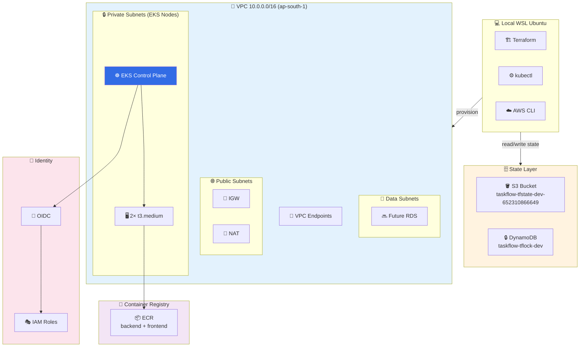
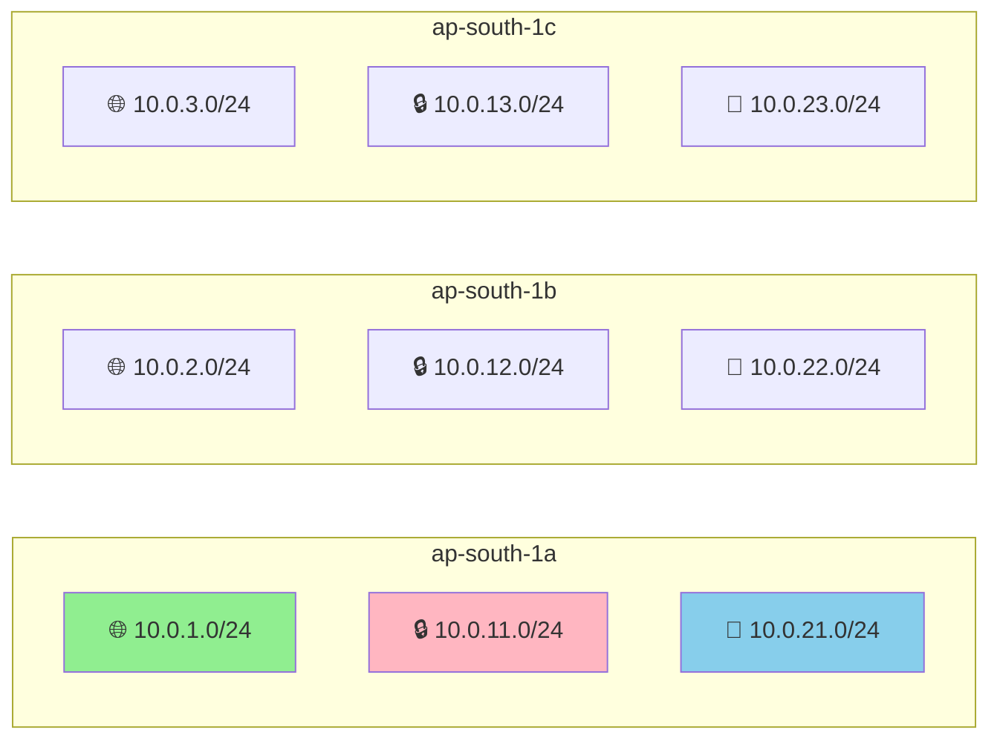
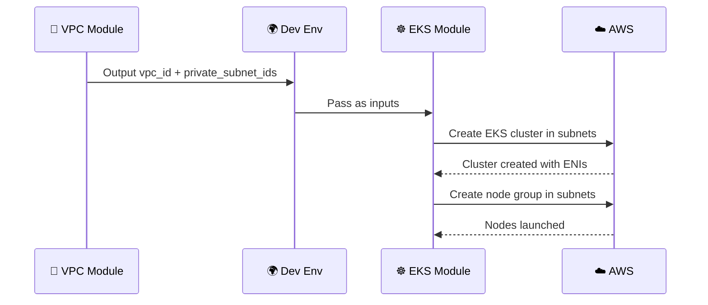
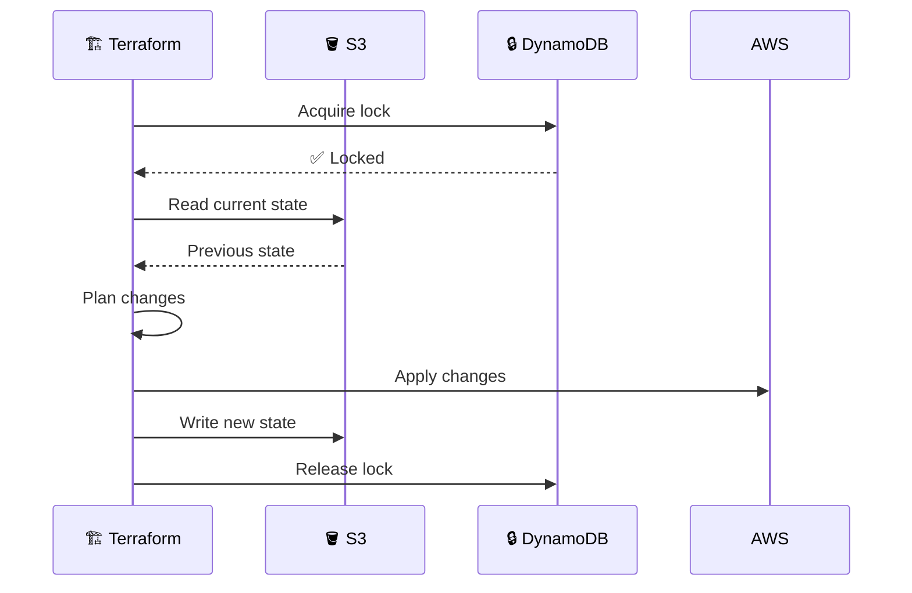
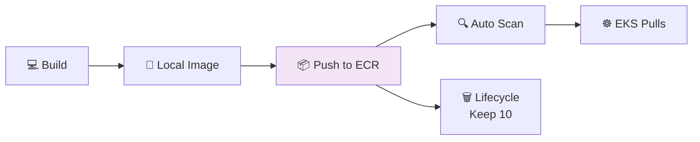
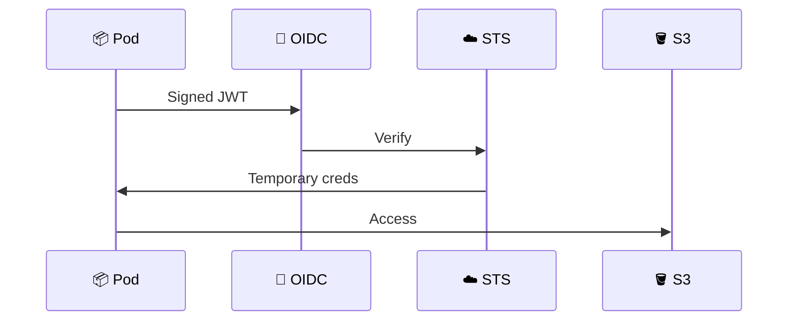
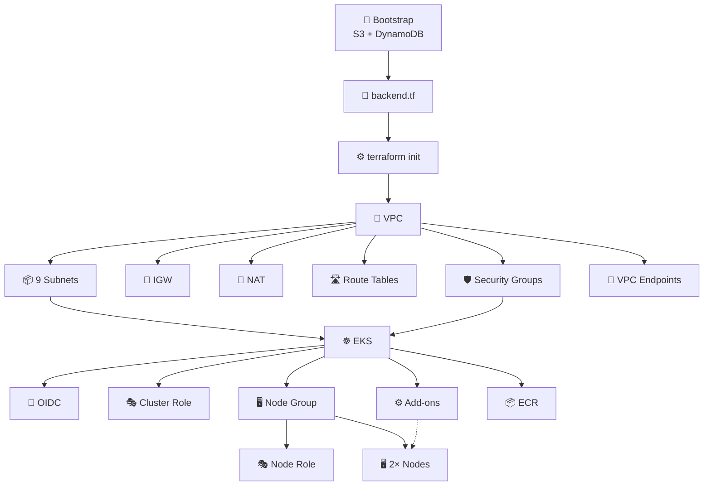

# ⚙️ TaskFlow Ops — Terraform Infrastructure (Stage 5)

> **Complete production-grade AWS infrastructure for TaskFlow — provisioned entirely with Terraform.**
> Multi-AZ VPC, EKS 1.33 cluster, ECR registries, IRSA identity, VPC endpoints — all as code.


---

## 📖 Table of Contents

1. [What This Stage Is](#1-what-this-stage-is)
2. [Business Story — Why Terraform](#2-business-story--why-terraform)
3. [What We Built](#3-what-we-built)
4. [Architecture — Full Picture](#4-architecture--full-picture)
5. [Every File — What, Why, Where](#5-every-file--what-why-where)
6. [How VPC Was Created](#6-how-vpc-was-created)
7. [How EKS Connects to VPC](#7-how-eks-connects-to-vpc)
8. [How S3 Holds State](#8-how-s3-holds-state)
9. [How ECR Stores Images](#9-how-ecr-stores-images)
10. [How IRSA Works](#10-how-irsa-works)
11. [Resource Dependency Graph](#11-resource-dependency-graph)
12. [Live Verification Commands](#12-live-verification-commands)
13. [Deployment Timeline](#13-deployment-timeline)
14. [Real-Time Issues We Hit & Fixed](#14-real-time-issues-we-hit--fixed)
15. [Troubleshooting Guide](#15-troubleshooting-guide)
16. [Root Cause Analysis](#16-root-cause-analysis)
17. [Cost Breakdown & Teardown](#17-cost-breakdown--teardown)
18. [Interview Questions & Answers](#18-interview-questions--answers)
19. [How to Explain in Interview](#19-how-to-explain-in-interview)
20. [Best Practices & Lessons](#20-best-practices--lessons)

---

## 1. What This Stage Is

**Stage 5** delivers the **entire AWS infrastructure for TaskFlow** using **Terraform only** — zero manual clicks in AWS Console.

### What It Covers

| Area | Delivered |
|------|-----------|
| State management | S3 backend + DynamoDB locking |
| Networking | Multi-AZ VPC, subnets, NAT, IGW, route tables |
| Compute | EKS 1.33 cluster with 2 worker nodes |
| Registry | ECR repos for backend + frontend |
| Identity | IAM roles, OIDC provider for IRSA |
| Cost controls | VPC endpoints, single NAT gateway |
| Security | Private subnets, least-privilege IAM |

### What It Doesn't Cover (Yet)

- ❌ RDS database (Stage 5b)
- ❌ Redis cache (Stage 5b)
- ❌ Application deployment (Stage 6)
- ❌ Observability stack (Stage 7)
- ❌ Istio service mesh (Stage 8)

---

## 2. Business Story — Why Terraform

### The Problem

TaskFlow needed cloud infrastructure. Options were:

| Option | Pros | Cons |
|--------|------|------|
| 🖱️ Click in AWS Console | Fast to start | Not reproducible, no audit |
| 🐚 AWS CLI scripts | Scriptable | Fragile, no state tracking |
| 📦 CloudFormation | AWS-native | Vendor lock-in, verbose YAML |
| 🏗️ **Terraform** ✅ | Multi-cloud, declarative, stateful | Learning curve |

### The Ask

> "We need to be able to destroy and recreate the **exact same** infrastructure at any time, in any region, with one command. No snowflake servers. No manual console clicks."

### The Solution

Terraform with:
- **Remote state** in S3 (durable, versioned, encrypted)
- **State locking** via DynamoDB (prevents concurrent corruptions)
- **Modular design** (VPC and EKS as reusable modules)
- **Environment isolation** (dev/staging/prod separate state files)

### Business Outcome

| Metric | Before | After |
|--------|--------|-------|
| Provision time | 2 days of clicking | 15 min `terraform apply` |
| Reproducibility | ❌ Manual | ✅ 100% |
| Audit trail | ❌ None | ✅ Git + state |
| Disaster recovery | ❌ Manual | ✅ `apply` from scratch |
| Cost awareness | ❌ Surprise bills | ✅ Tagged, tracked |

---

## 3. What We Built

### Resource Summary

| Resource | Count | Notes |
|----------|:-----:|-------|
| S3 Buckets | 1 | Terraform state |
| DynamoDB Tables | 1 | State lock |
| VPC | 1 | 10.0.0.0/16 |
| Subnets | 9 | 3 AZs × 3 tiers |
| Internet Gateway | 1 | Public egress/ingress |
| NAT Gateway | 1 | Private subnet egress |
| Elastic IP | 1 | NAT static IP |
| Route Tables | 4 | 1 public + 3 private/data |
| Route Table Assocs | 9 | Subnet bindings |
| Security Groups | 2 | EKS + VPC endpoints |
| VPC Endpoints | 3 | S3, ECR API, ECR DKR |
| EKS Cluster | 1 | v1.33, ap-south-1 |
| EKS Node Group | 1 | 2× t3.medium |
| EKS Add-ons | 3 | CNI, CoreDNS, kube-proxy |
| IAM Roles | 2 | Cluster + node |
| IAM Policy Attachments | 5 | AWS managed |
| IAM OIDC Provider | 1 | For IRSA |
| ECR Repositories | 2 | backend + frontend |
| ECR Lifecycle Policies | 2 | Keep last 10 images |
| **Total** | **~50** | **100% as code** |

### Live Status

| Component | Status |
|-----------|--------|
| EKS Cluster | ✅ ACTIVE |
| Nodes | ✅ 2 Ready |
| CoreDNS | ✅ 2 pods Running |
| kube-proxy | ✅ 2 pods Running |
| AWS VPC CNI | ✅ 2 pods Running |
| ECR Repos | ✅ 2 registered |
| OIDC Provider | ✅ Ready |

---

## 4. Architecture — Full Picture



### Connection Summary

| From | To | Purpose |
|------|-----|---------|
| Terraform | S3 | Store state |
| Terraform | DynamoDB | Lock state |
| Terraform | AWS APIs | Create resources |
| EKS Control Plane | Private Subnets | Host ENIs |
| EKS Nodes | Private Subnets | Run workloads |
| EKS Nodes | NAT Gateway | Outbound internet |
| EKS Nodes | VPC Endpoints | Private AWS access |
| EKS Nodes | ECR | Pull images |
| EKS Cluster | IAM Role | Permissions |
| EKS Nodes | IAM Role | Permissions |
| EKS | OIDC | IRSA foundation |

---

## 5. Every File — What, Why, Where

### Repo Structure

```
taskflow-ops/
├── terraform/
│   ├── bootstrap/
│   │   ├── main.tf
│   │   ├── variables.tf
│   │   └── outputs.tf
│   ├── modules/
│   │   ├── vpc/
│   │   │   ├── main.tf
│   │   │   ├── variables.tf
│   │   │   ├── outputs.tf
│   │   │   └── versions.tf
│   │   └── eks/
│   │       ├── main.tf
│   │       ├── variables.tf
│   │       ├── outputs.tf
│   │       └── versions.tf
│   └── environments/
│       └── dev/
│           ├── main.tf
│           ├── backend.tf
│           ├── variables.tf
│           ├── versions.tf
│           └── outputs.tf
├── .gitignore
├── LICENSE
└── README.md
```

### File-by-File Documentation

#### `terraform/bootstrap/main.tf`

| Field | Value |
|-------|-------|
| 📄 **What** | Creates S3 bucket + DynamoDB table for Terraform state |
| ❓ **Why** | Terraform needs a durable, shared, lockable state store |
| 🎯 **Use** | Run once; sets up foundational state infrastructure |
| 📍 **Where** | Runs before all other Terraform configs |
| 🔗 **Connects** | Outputs used in `environments/dev/backend.tf` |
| ⚠️ **Without it** | State stored locally = risky, no team collaboration |
| 💡 **Analogy** | Building a filing cabinet before writing documents |

#### `terraform/bootstrap/variables.tf`

| Field | Value |
|-------|-------|
| 📄 **What** | Input variables: region, project name, environment |
| ❓ **Why** | Avoid hardcoding; make bootstrap reusable |
| 🎯 **Use** | Configures bucket naming and region |
| 📍 **Where** | Root of bootstrap module |
| 🔗 **Connects** | Consumed by `main.tf` |
| ⚠️ **Without it** | Would need hardcoded values everywhere |
| 💡 **Analogy** | A settings file for a script |

#### `terraform/bootstrap/outputs.tf`

| Field | Value |
|-------|-------|
| 📄 **What** | Exposes bucket name, table name, account ID |
| ❓ **Why** | Values are needed to configure other stacks |
| 🎯 **Use** | Copy into `backend.tf` |
| 📍 **Where** | Bootstrap module output |
| 🔗 **Connects** | Read manually by developer |
| ⚠️ **Without it** | Must grep AWS Console |
| 💡 **Analogy** | A receipt with all details |

#### `terraform/modules/vpc/main.tf`

| Field | Value |
|-------|-------|
| 📄 **What** | VPC, 9 subnets, IGW, NAT, route tables, SGs, VPC endpoints |
| ❓ **Why** | EKS needs isolated network with public/private/data tiers |
| 🎯 **Use** | Network foundation for all resources |
| 📍 **Where** | Called from `environments/dev/main.tf` |
| 🔗 **Connects** | Outputs subnet IDs to EKS module |
| ⚠️ **Without it** | No networking = no cluster = no app |
| 💡 **Analogy** | Building roads, gates, and intersections for a new city |

#### `terraform/modules/vpc/variables.tf`

| Field | Value |
|-------|-------|
| 📄 **What** | VPC module inputs (CIDRs, AZs, NAT settings) |
| ❓ **Why** | Makes module flexible across environments |
| 🎯 **Use** | Customize VPC per environment |
| 📍 **Where** | VPC module root |
| 🔗 **Connects** | Consumed by `main.tf` |
| ⚠️ **Without it** | Module would be non-reusable |
| 💡 **Analogy** | A blueprint template with adjustable fields |

#### `terraform/modules/vpc/outputs.tf`

| Field | Value |
|-------|-------|
| 📄 **What** | Exposes VPC ID, subnet IDs, NAT IDs |
| ❓ **Why** | EKS module needs subnet IDs |
| 🎯 **Use** | Wiring between modules |
| 📍 **Where** | VPC module output |
| 🔗 **Connects** | Consumed by EKS module |
| ⚠️ **Without it** | Modules can't talk to each other |
| 💡 **Analogy** | A connector cable between devices |

#### `terraform/modules/vpc/versions.tf`

| Field | Value |
|-------|-------|
| 📄 **What** | Pins Terraform + provider versions |
| ❓ **Why** | Prevents surprise upgrades breaking code |
| 🎯 **Use** | Guarantees reproducible installs |
| 📍 **Where** | VPC module root |
| 🔗 **Connects** | Read by `terraform init` |
| ⚠️ **Without it** | Silent version drift |
| 💡 **Analogy** | A package.json with pinned deps |

#### `terraform/modules/eks/main.tf`

| Field | Value |
|-------|-------|
| 📄 **What** | EKS cluster, node group, IAM roles, add-ons, OIDC, ECR |
| ❓ **Why** | Managed K8s runs containerized apps |
| 🎯 **Use** | Compute + registry + identity layer |
| 📍 **Where** | Called from `environments/dev/main.tf` |
| 🔗 **Connects** | Consumes VPC subnet IDs; outputs cluster info |
| ⚠️ **Without it** | No place to run pods |
| 💡 **Analogy** | The factory inside the industrial park |

#### `terraform/modules/eks/variables.tf`

| Field | Value |
|-------|-------|
| 📄 **What** | EKS module inputs (cluster version, node sizes) |
| ❓ **Why** | Allows tuning per environment |
| 🎯 **Use** | Configure cluster for dev/staging/prod |
| 📍 **Where** | EKS module root |
| 🔗 **Connects** | Consumed by `main.tf` |
| ⚠️ **Without it** | No flexibility |
| 💡 **Analogy** | Configurable factory settings |

#### `terraform/modules/eks/outputs.tf`

| Field | Value |
|-------|-------|
| 📄 **What** | Exposes cluster name, endpoint, OIDC ARN, ECR URLs |
| ❓ **Why** | Downstream tools need these (kubectl, CI/CD) |
| 🎯 **Use** | Wiring to ArgoCD, CI pipelines |
| 📍 **Where** | EKS module output |
| 🔗 **Connects** | Consumed by other stacks |
| ⚠️ **Without it** | No way to reach cluster |
| 💡 **Analogy** | An address book with important contacts |

#### `terraform/environments/dev/main.tf`

| Field | Value |
|-------|-------|
| 📄 **What** | Root module wiring VPC + EKS together |
| ❓ **Why** | Each environment composes modules differently |
| 🎯 **Use** | Entry point for `terraform apply` |
| 📍 **Where** | Dev environment root |
| 🔗 **Connects** | Reads module outputs, passes as inputs |
| ⚠️ **Without it** | No way to compose modules |
| 💡 **Analogy** | A blueprint combining plumbing, electrical, HVAC |

#### `terraform/environments/dev/backend.tf`

| Field | Value |
|-------|-------|
| 📄 **What** | S3 backend configuration |
| ❓ **Why** | Tells Terraform WHERE to store state |
| 🎯 **Use** | Points to bootstrap-created S3 bucket |
| 📍 **Where** | Configured during `terraform init` |
| 🔗 **Connects** | Links local Terraform to remote S3 |
| ⚠️ **Without it** | State saved locally = dangerous |
| 💡 **Analogy** | Telling Google Docs where to save your file |

#### `terraform/environments/dev/variables.tf`

| Field | Value |
|-------|-------|
| 📄 **What** | Env-level inputs (region, project, environment) |
| ❓ **Why** | Keeps env configurable without code changes |
| 🎯 **Use** | Override via `terraform.tfvars` |
| 📍 **Where** | Dev env root |
| 🔗 **Connects** | Consumed by `main.tf` |
| ⚠️ **Without it** | Values hardcoded |
| 💡 **Analogy** | Environment-specific settings file |

#### `terraform/environments/dev/versions.tf`

| Field | Value |
|-------|-------|
| 📄 **What** | Pins Terraform + providers for env |
| ❓ **Why** | Locks versions per environment |
| 🎯 **Use** | Prevents drift between env applies |
| 📍 **Where** | Dev env root |
| 🔗 **Connects** | Read by `terraform init` |
| ⚠️ **Without it** | Silent breakage on upgrades |
| 💡 **Analogy** | Pinned Node.js version in `.nvmrc` |

#### `terraform/environments/dev/outputs.tf`

| Field | Value |
|-------|-------|
| 📄 **What** | Exposes env outputs (VPC ID, cluster name, ECR URLs) |
| ❓ **Why** | Scripts and humans need these values |
| 🎯 **Use** | Consume via `terraform output` |
| 📍 **Where** | Dev env output |
| 🔗 **Connects** | Used by CI/CD and scripts |
| ⚠️ **Without it** | Must query AWS directly |
| 💡 **Analogy** | A summary report at the end of a process |

#### `.gitignore`

| Field | Value |
|-------|-------|
| 📄 **What** | Ignores state files, plans, secrets |
| ❓ **Why** | **Never commit state or secrets to Git** |
| 🎯 **Use** | Protects against leaks |
| 📍 **Where** | Repo root |
| 🔗 **Connects** | Read by Git on every commit |
| ⚠️ **Without it** | AWS keys + infra details leak |
| 💡 **Analogy** | A "do not mail" list for sensitive files |

---

## 6. How VPC Was Created

### Step 1 — VPC

```hcl
resource "aws_vpc" "main" {
  cidr_block           = "10.0.0.0/16"
  enable_dns_hostnames = true
  enable_dns_support   = true
}
```

**Why 10.0.0.0/16?** 65,536 IPs — room to grow without re-architecture. RFC 1918 range.

### Step 2 — Subnets (3 Tiers × 3 AZs)



### Step 3 — IGW + NAT

| Component | Purpose |
|-----------|---------|
| Internet Gateway | Public subnets outbound/inbound |
| NAT Gateway | Private subnets outbound only |
| Elastic IP | Static public IP for NAT |

### Step 4 — Route Tables

| Route Table | Attached To | Route |
|-------------|-------------|-------|
| Public RT | 3 public subnets | 0.0.0.0/0 → IGW |
| Private RT | 3 private subnets | 0.0.0.0/0 → NAT |
| Data RT | 3 data subnets | 0.0.0.0/0 → NAT |

### Step 5 — VPC Endpoints

| Endpoint | Type | Purpose |
|----------|------|---------|
| S3 | Gateway | Free private S3 access |
| ECR API | Interface | Pull image metadata |
| ECR DKR | Interface | Pull image layers |

**Cost saving:** ECR pulls go through endpoints, not NAT — massive savings.

---

## 7. How EKS Connects to VPC

### The Critical Wiring

```hcl
module "eks" {
  source             = "../../modules/eks"
  vpc_id             = module.vpc.vpc_id
  private_subnet_ids = module.vpc.private_subnet_ids
}
```

### Step-by-Step



### Why Private Subnets?

| Reason | Benefit |
|--------|---------|
| Security | No public IP on nodes |
| Compliance | Isolated from internet |
| Cost | No NAT per node |
| Auditability | All egress via NAT logged |

### How Pods Reach AWS Services

Two paths:

| Path | When | Cost |
|------|------|------|
| VPC Endpoint | S3, ECR | Free/cheap |
| NAT Gateway | Other AWS APIs | $0.045/hr + data |

---

## 8. How S3 Holds State

### The Flow



### Key Features

| Feature | Why |
|---------|-----|
| S3 versioning | Recover from state corruption |
| AES256 encryption | State has sensitive data |
| Public access block | Compliance |
| DynamoDB lock | Prevent concurrent applies |

---

## 9. How ECR Stores Images

### The Flow



### Why ECR?

| Reason | Benefit |
|--------|---------|
| IAM auth | No separate creds |
| Same-region | Fast + cheap |
| VPC endpoint | Free pulls |
| Scanning | Built-in CVE detection |

---

## 10. How IRSA Works

### The Problem

Giving node-level IAM = every pod inherits permissions. 😱

### The Solution



### What We Created

- OIDC provider (trust between EKS and IAM)
- Ready for roles in Stage 6 (EBS CSI, External Secrets, etc.)

---

## 11. Resource Dependency Graph



---

## 12. Live Verification Commands

```bash
# Cluster status
aws eks describe-cluster --name taskflow-dev --region ap-south-1 --query 'cluster.status'
# "ACTIVE"

# Nodes
kubectl get nodes
# 2 nodes Ready, v1.33.13-eks-3b4a6ca

# System pods
kubectl get pods -A
# aws-node, coredns, kube-proxy all Running

# ECR repos
aws ecr describe-repositories --region ap-south-1 --query 'repositories[].repositoryName'
# ["taskflow/backend", "taskflow/frontend"]

# Add-ons
aws eks list-addons --cluster-name taskflow-dev --region ap-south-1
# ["coredns", "kube-proxy", "vpc-cni"]

# Terraform state
terraform state list | wc -l
# ~50 resources
```

---

## 13. Deployment Timeline

| Time | Event |
|------|-------|
| T+0 | `terraform apply` bootstrap → 5 resources in 8 sec |
| T+1min | `terraform init` in dev env |
| T+2min | `terraform plan` → 52 to add |
| T+2min | **Issue 1:** version 1.29 unsupported → fixed to 1.33 |
| T+5min | `terraform apply` retry → VPC builds in 2 min |
| T+8min | IAM roles created |
| T+10min | EKS cluster creating ⏳ |
| T+20min | EKS cluster ACTIVE |
| T+22min | Node group creating ⏳ |
| T+27min | Nodes Ready |
| T+27min | **Issue 2:** EBS CSI add-on timeout → fixed by disabling |
| T+28min | Final apply → 0 changes → ✅ Complete |

---

## 14. Real-Time Issues We Hit & Fixed

### Issue 1 — Unsupported Kubernetes Version

**Error:**
```
InvalidParameterException: unsupported Kubernetes version 1.29
```

**Root Cause:** AWS retires K8s versions ~14 months after release. As of Oct 2026, only 1.30–1.37 are supported in `ap-south-1`.

**Fix:** Changed `cluster_version = "1.29"` → `"1.33"`

**Lesson:** **Never hardcode AWS versions** — parameterize and add CI check.

### Issue 2 — EBS CSI Add-on Timeout

**Error:**
```
timeout while waiting for state to become 'ACTIVE' (timeout: 20m0s)
```

**Root Cause:** EBS CSI needs an IRSA role to call EC2 APIs. We hadn't created it yet.

**Fix:** Disabled the add-on temporarily. Will re-enable with proper IRSA in Stage 6.

**Lesson:** **Order matters in Terraform.** Add-ons that need IAM roles must come AFTER IRSA is set up.

### Issue 3 — Duplicate Cleanup Commands

**Error:**
```
Error: Invalid target address — no matching objects found
An error occurred (ResourceNotFoundException): addon doesn't exist
```

**Root Cause:** Ran `terraform state rm` + `aws eks delete-addon` twice. Second run found nothing to remove.

**Fix:** None needed — harmless. Terraform is idempotent.

**Lesson:** **Terraform commands are idempotent** — safe to re-run.

---

## 15. Troubleshooting Guide

### EKS cluster stuck in CREATING

| Root Cause | Fix |
|-----------|-----|
| Node group waiting on IAM | Check `aws iam get-role --role-name taskflow-dev-eks-cluster-role` |
| Subnet issues | Verify subnet tags `kubernetes.io/cluster/taskflow-dev` |
| Service quota | Check EC2 limits in AWS Console |

### Nodes not joining cluster

| Root Cause | Fix |
|-----------|-----|
| IAM node role missing policies | Attach `AmazonEKSWorkerNodePolicy` |
| Subnet misconfiguration | Verify private subnets have correct tags |
| Security group blocking | Allow cluster SG egress |

### ECR image push fails

| Root Cause | Fix |
|-----------|-----|
| Not logged in | `aws ecr get-login-password \| docker login ...` |
| IAM user lacks ECR perms | Attach `AmazonEC2ContainerRegistryPowerUser` |
| Wrong region | Verify `--region ap-south-1` |

### Terraform state locked

| Root Cause | Fix |
|-----------|-----|
| Previous apply crashed | `terraform force-unlock <LOCK_ID>` |
| Multiple applies running | Wait or kill process |

---

## 16. Root Cause Analysis

### RCA 1 — Version Retirement

| Question | Answer |
|----------|--------|
| **What happened** | `terraform apply` failed on EKS creation |
| **Why** | K8s 1.29 retired in ap-south-1 |
| **Detection** | `InvalidParameterException` from AWS |
| **Blast radius** | EKS cluster only (VPC unaffected) |
| **Fix time** | 1-line change + 10 min re-apply |
| **Prevention** | Parameterize version; add CI check against supported list |
| **Lesson** | Never hardcode AWS resource versions |

### RCA 2 — Add-on Ordering

| Question | Answer |
|----------|--------|
| **What happened** | EBS CSI timed out after 20 min |
| **Why** | Missing IRSA role — add-on couldn't call EC2 |
| **Detection** | Terraform timeout on state transition |
| **Blast radius** | Only EBS CSI add-on |
| **Fix time** | 5 min (disable temporarily) |
| **Prevention** | Create IRSA before add-on in Terraform |
| **Lesson** | Order matters; explicit dependencies |

---

## 17. Cost Breakdown & Teardown

### Monthly Cost (ap-south-1)

| Resource | Cost |
|----------|------|
| EKS Control Plane | ~$73/mo |
| 2× t3.medium nodes | ~$60/mo |
| NAT Gateway | ~$35/mo |
| EBS + data transfer | ~$12/mo |
| S3 state bucket | ~$0.10/mo |
| DynamoDB lock | ~$0.00 (PAY_PER_REQUEST) |
| **Total** | **~$180/mo** |

### Teardown Command

```bash
cd ~/velguru/taskflow-ops/terraform/environments/dev
terraform destroy -auto-approve
```

**Keeps:** S3 state + DynamoDB (tiny cost)
**Cost after destroy:** ~$0.10/mo

### Recreate

```bash
cd ~/velguru/taskflow-ops/terraform/environments/dev
terraform apply -auto-approve
aws eks update-kubeconfig --region ap-south-1 --name taskflow-dev
# ~15 min → cluster back
```

---

## 18. Interview Questions & Answers

### Q1: Why Terraform over CloudFormation?

**Answer:** *"Terraform is multi-cloud and uses HCL — cleaner than CloudFormation YAML. It has better state management, larger community, and works across AWS, Azure, GCP. CloudFormation locks us into AWS only."*

### Q2: Why S3 for state and not locally?

**Answer:** *"Local state doesn't work for teams — no locking, no history, risk of loss. S3 gives us durability, versioning, and encryption. DynamoDB adds locking so concurrent applies don't corrupt state."*

### Q3: What is state locking?

**Answer:** *"When Terraform runs, it acquires a lock in DynamoDB. If another apply tries to run simultaneously, it fails immediately. Prevents two engineers from stepping on each other."*

### Q4: Why modules instead of one big file?

**Answer:** *"Modules give us reuse. VPC code is written once, used in dev/staging/prod and across regions. They're also testable and versioned independently. Our VPC module has no dependencies on EKS — clean separation."*

### Q5: Why 3 AZs and not just 1?

**Answer:** *"Single AZ = single point of failure. AWS best practice is 3 AZs because quorum-based systems need odd numbers, and you survive one AZ outage with 2/3 still running. This is the enterprise standard."*

### Q6: Why separate data subnets?

**Answer:** *"Data subnets isolate databases from workloads. If a pod is compromised, it can't reach RDS directly — separate route tables and security groups enforce this. It's defense in depth."*

### Q7: Why a single NAT gateway?

**Answer:** *"Cost optimization for dev — one NAT saves ~$35/mo per AZ. In production, we'd use one NAT per AZ for high availability. It's a dev-vs-prod trade
